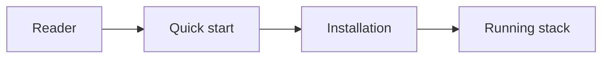

# How we document

This page is the governance for the docs site. Read it before you add or change a
page. The rule is short: **put a doc where its code lives, document every unit,
keep it current, and ship it in the same PR as the code.**

## The doc process

1. **Read the file first.** Do not guess from the name. Open the source before you
   document it.
2. **Document every unit.** Every surface, package, module, and shared service has
   a page. List every public export, prop, route, and dependency.
3. **Mirror the code spine.** A doc's folder matches the code it documents:
   `projects/ · packages/{shared,web,mobile}/ · modules/web/ · shared/`.
4. **Add the page and the sidebar line together.** Drop the `.md`, then add one
   line in `.vitepress/config.mts`. No orphan pages.
5. **Link the source and the doc.** The source file carries a `@see` link to its
   doc; the doc links back to the source.
6. **Ship docs with the code.** Same PR. A stale guide is worse than no guide.

## Frontmatter (every page)

Every page starts with YAML frontmatter:

```yaml
---
title: <short page title>
description: <one sentence>
status: stable | draft | template
order: <number within its sidebar group>
---
```

## The section contract, by page type

Match the sections to the page type. Keep each page as long as its subject needs,
no longer.

- **Surface** (`projects/**`): Purpose · Stack / Platform class · Wired baseline ·
  Routes / pages · Deploy · Registry.
- **Package** (`packages/**`): Purpose (tagline + package id) · Exports · Usage
  example (import + call) · Consumers · Flags.
- **Module** (`modules/web/**`): Purpose · Feature flag · Schema / blocks · Routes ·
  Editor guide.
- **Config** (`projects/web/website/config/**`): Purpose · The one config object ·
  Options table · Gating.
- **Service** (`shared/{api,cron,workers}/**`): Purpose · Routes / triggers ·
  Bindings / env · Deploy · Registry.

## Ordering — newcomer-first

The sidebar reads top-to-bottom as a newcomer would: Quick start → Installation →
overview → contributing → setup → configuration → design → SEO → surfaces →
services → modules → architecture → packages. A reference-heavy group collapses
and sub-groups once it passes ~15 items (see Packages).

## Issue tags — the Flags section

A page's **Flags** section surfaces the issue tags found in its source. The
vocabulary is closed: `@complexity`, `@refactor`, `@debt`, `@bug`,
`@optimisation`. `pnpm check:tags` fails on any off-list qualifier. See the repo
rule at `.claude/rules/issue-tags.md`. Omit the section when the source carries no
tags.

## Diagrams

Use mermaid for architecture and data-flow diagrams — it is diagrams-as-code, so it
stays in review and in version control. Use ASCII trees only for file layouts.



## Decisions — ADRs

Record an architecture decision as an ADR. See
[Architecture decisions](/contributing/adr/) and the
[template](/contributing/adr/0000-template).

## Links and the build

Genuine in-site broken links **fail the build** (`ignoreDeadLinks` is an
allow-list, not `true`). The allow-list covers one case only: pointers into the
code tree (`_registry.md`, `DESIGN.md`, `CLAUDE.md`, `.claude/`) — these are
source of truth, not site pages.

Everything else must resolve. A link into the code tree that is not one of those
belongs in backticks, not a link. A bare `http://localhost:...` URL belongs in
backticks too, so it is code, not an auto-linked dead link. Run `pnpm docs:build`
before you push; a green build is the link check.

## Coverage — every file

Two altitudes, both complete and enforced:

- **Unit pages** — one curated page per surface, package, module, and service,
  in the hand-written sidebar above.
- **Per-file reference** — every source file has its own page under
  `reference/`, mirroring the code tree, listed in the auto-generated **Source
  reference** sidebar group. Each source file also carries a JSDoc/TSDoc header
  with a `@see` back to its page (generated files and CLI-managed `ui/`
  primitives get a page but no header — never edit those).

`pnpm check:doc-coverage` is the gate (wired into `pnpm verify`): it fails if any
code unit has no page **or** any source file has no `reference/` page. A new source
file must ship with its reference page and header in the same PR.

The per-file page contract: frontmatter, a one-line tagline, **Purpose**,
**Exports**, an optional **Usage** fence, and a **Source** path. The doc path is
the source path under `reference/` with the extension changed to `.md` (and the
surface `surfaces/` segment dropped).
