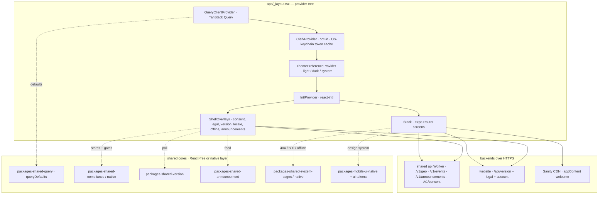

# Mobile (Expo)

> `@indiecrafts/mobile-surfaces-main` — the native client: the whole shell wired, the first product screen (`account`) shipped.

## Purpose

Mobile is the **React Native (Expo)** client for a tenant. It renders the same brand
from the same Sanity dataset the web surfaces use, and it talks to the shared `api`
Worker (or the website `/api` routes) over HTTPS — never to a database directly.

It is a **separate platform class**. Where `website` and `admin` are `next-cf` (Next → OpenNext →
Cloudflare), mobile is `expo`: it ships through **EAS Build → App Store / Play Store**, with
over-the-air patches via **EAS Update**. It sits outside the default `deploy:all` Cloudflare set.
React Native pins React `18.3`; the web surfaces run React `19`, so only **React-free bricks**
are shared across the boundary. Everything React forks per platform (the `native/` layer).

The shell is complete — providers, i18n, theme, status pages, the compliance / version / locale
overlays, and Clerk OTP auth. One product screen (`account`) is live; further screens are the
next surface of work, built on `app/index.tsx` as the pattern.

## Architecture

The root layout (`app/_layout.tsx`) wraps every screen in one provider tree. Auth is **opt-in**:
`<ClerkProvider>` mounts only when `EXPO_PUBLIC_CLERK_PUBLISHABLE_KEY` is set, so the app runs
unchanged without it. `ShellOverlays` mounts alongside the router `<Stack>` — inside i18n and theme
context — so its banners are themed and translated.



**Walk-through, outermost first:**

- **`<QueryClientProvider>`** — one `QueryClient` at module scope (survives re-renders), with the
  shared `queryDefaults` from `@indiecrafts/packages-shared-query`. Screens fetch with
  `useQuery` / `useMutation`; the `queryFn` calls the shared api.
- **`<ClerkProvider>`** (opt-in) — mounts only when `hasClerk`. Its `tokenCache` writes the session
  to `expo-secure-store` (the OS keychain), never AsyncStorage. Two invisible side-cars ride inside
  it: `SignInLogger` records each sign-in once per session to the EU D1 session log
  (`/v1/events`), and `LocaleSync` mirrors a deliberate locale choice to the user's Clerk
  `unsafeMetadata.locale` so their emails follow their language.
- **`<ThemePreferenceProvider>`** — a persisted `light` / `dark` / `system` choice (`lib/theme-preference`)
  over the shared tokens, wrapping `ui-native`'s `<ThemeProvider>`. `system` follows the OS; the
  home screen has a 3-way switch. The pure resolve logic lives in `lib/theme-resolve` (unit-tested).
- **`<IntlProvider>`** — `react-intl` with the resolved locale. A stored choice wins over the
  auto-detected device locale; switching re-renders `IntlProvider` with new messages (RN has no
  page reload).
- **`<Stack>` + `ShellOverlays`** — the Expo Router screens, with the compliance / version / locale
  overlays layered on top. The `ErrorBoundary` export renders the themed, translated 500 screen.

## Screens / navigation

Expo Router file routes under `app/` (headers hidden; each screen is a themed `<Screen>` from the
native design system):

| Route         | File                 | What it does                                                                                                                                                                                   |
| ------------- | -------------------- | ---------------------------------------------------------------------------------------------------------------------------------------------------------------------------------------------- |
| `/` (Home)    | `app/index.tsx`      | Editor-owned welcome from Sanity (`useQuery` → `getWelcome`, fail-open to the message file), the 3-way theme control, an OS share sheet (`Share.share`), and nav to legal / sign-in / account. |
| `/sign-in`    | `app/sign-in.tsx`    | The Clerk OTP flow (email-code) + Google SSO. Renders `NotConfigured` without Clerk, a signed-in view when authed, else the sign-in form.                                                      |
| `/account`    | `app/account.tsx`    | Signed-in only (redirects home without Clerk). The native cookie-preferences panel + two web hand-offs.                                                                                        |
| `/legal`      | `app/legal.tsx`      | Links out to the website's legal pages (`LEGAL_PAGE_KEYS` → `Linking.openURL`) — no content re-hosting.                                                                                        |
| `/+not-found` | `app/+not-found.tsx` | The themed, translated 404 (`NotFoundContent` from `system-pages/native`).                                                                                                                     |
| _root layout_ | `app/_layout.tsx`    | The provider tree above, plus the `ErrorBoundary` (500) export.                                                                                                                                |

**Sign-in — a Clerk OTP state machine.** `app/sign-in.tsx` owns every Clerk call (`useSignIn` /
`useSignUp` / `useSSO`) but keeps no auth logic in the component body. Its step / mode / busy / error
state lives in the pure `signInReducer` (`lib/sign-in-machine.ts`) — no Clerk or react-intl imports,
so it is unit-testable in isolation:

```text
step:  email → code          mode:  signin | signup
State: { step, mode, busy, error }        error = an i18n message id, translated at render
Actions: submit · codeSent · settled · failed · changeEmail
```

One email field drives both paths: `signIn.create` is tried first (existing user → email-code
sign-in); on failure it falls through to `signUp.create` (new user → email-code sign-up), carrying
the app locale and the marketing opt-in in `unsafeMetadata`. A wrong OTP on the sign-in path is
reported to the api (`logFailedLogin` → `/v1/events`, counted at the edge, no PII).

**Account — a web hand-off for the heavy actions.** `app/account.tsx` renders the shared
`ConsentPreferences` panel (backed by the single `consentStore`) with a Save button, then two
`expo-web-browser` hand-offs to the canonical web account (`accountUrl`): one for the granular
email preference centre, one for **Manage account**. Profile, security, data **export**, and
account **deletion** are all web-only — the in-app browser tab (SFSafariViewController / Custom
Tabs) shares the system cookie jar, so an existing web session usually carries over. Deletion stays
on the web because that is where the churn exit-survey lives. There is deliberately **no native
delete or export control**.

## Wired baseline

- **i18n (react-intl).** `lib/i18n.ts` runs a detect + format split: `expo-localization` reads the
  device locale, then `react-intl` formats the app's own `messages/{en,fr}.json` (the same ICU
  format as web, flattened) merged with the shared `SHELL_COPY` (404 / 500 / offline). The choice
  persists under `STORAGE_KEYS.locale` and switches at runtime; the vocabulary (`isLocale` /
  `localeCodes`) comes from `@/config`.
- **Design system (`ui-native`).** Screens compose `@indiecrafts/packages-mobile-ui-native`
  (shadcn-for-RN: `Screen` · `ThemedText` · `Button` · `Card` + `useTheme` / `useColor`) over
  `ui-tokens/native` — the same OKLCH token source the web contrast gate checks. Use the **native**
  design system, never the web shadcn `ui`. Page-builder block renderers stay web-only.
- **Compliance / version / locale overlays.** `components/ShellOverlays.tsx` mounts:
  a geo-gated consent banner + legal re-acceptance popup (`compliance/native`, an AsyncStorage
  store, gated by `config.features.requireConsent` — off by default; the mode resolves per country
  via the api `GET /v1/geo` + `config.consent` in `lib/geo.ts`, failing safe to opt-in); a version
  banner that polls the website's `/api/version` on each `AppState` "active" (informs + dismiss —
  the OTA apply half is EAS Update); a first-run locale suggestion (`pickSuggestedLocale`); and an
  offline banner (`useNetworkStatus` via `@react-native-community/netinfo`). All keys live once in
  `STORAGE_KEYS` (`@/config`) — never an inline `${sitePrefix}.…`.
- **Auth (Clerk OTP + OS-keychain token cache).** `@clerk/clerk-expo`, opt-in on
  `EXPO_PUBLIC_CLERK_PUBLISHABLE_KEY` (`lib/auth.ts`). The `tokenCache` persists the session to
  `expo-secure-store`, and Clerk's own UI localizes per app locale (`@clerk/localizations`, degrading
  to English for an unmapped language). A one-time `MarketingNudgeGate` prompts a signed-in user who
  has made no marketing-email decision yet (→ `/v1/consent/marketing-email`).
- **Announcements.** `AnnouncementOverlay` reads the api Worker's public `/v1/announcements`
  (surface `mobile`) and renders a top banner strip + a bottom toast, signed-in and online only.
  Dismiss is remembered per content `version`; a new announcement re-shows. Every colour comes from
  the shared `useTheme` tokens.
- **Persistence + fonts.** `lib/storage` wraps AsyncStorage never-throw for non-secret prefs; secrets
  use `expo-secure-store` (`lib/secure-storage`). The build-time `EXPO_PUBLIC_EVENTS_TOKEN` is a
  least-privilege ingest bearer (not the admin `APP_API_TOKEN`). Fonts are deferred — Satoshi ships
  as web `.woff2`; RN needs `.ttf` / `.otf`, so the shell renders with the system font until an
  `.otf` lands in `ui-fonts`.

Instance config (`sitePrefix` · `websiteUrl` · `accountUrl` · `features` · `consent` ·
`policyVersion` · Sanity ids) lives in `config/index.ts`, re-exporting the portable core from
`@indiecrafts/packages-shared-config/mobile`. Lint here is `npx expo lint` (Expo's own RN config),
not the website's Next config.

## Deploy

Mobile ships through **EAS**, not Cloudflare:

```bash
pnpm deploy:mobile:main:dev      # or :staging | :prod
```

The root script fans out to `code/shared/scripts/deploy/expo.mjs`, which maps the env to an EAS
build profile (`dev` → `development`, `staging` → `preview`, `prod` → `production`), runs
`eas build --platform all`, and on `prod` also runs `eas submit`. Each profile in `eas.json` bakes
its own `EXPO_PUBLIC_API_URL` (the shared api origin for that env). `app.config.ts` carries the OTA
wiring — a `runtimeVersion` policy of `appVersion` and the EAS Update feed URL — with the
`EAS_PROJECT_ID` and store credentials filled by `eas init` / `eas build:configure`. The full deploy
is structure-first; the store credentials are a follow-up (see the surface README).

`pnpm deploy:all:<env> --only all` reaches mobile — the default `deploy:all` set is Cloudflare-only
and skips native.

**Registry.** One row in `code/shared/scripts/lib/apps.mjs`: slug `mobile`, class `expo`, platform
`mobile`, kind `surface`, order `50`, dir `code/projects/mobile/surfaces/main`. CI and every path
resolver read that row — never a hard-coded path. The cross-surface shell model lives in
[cross-platform-shell](/shared/architecture/cross-platform-shell); the full deploy model in
[platform-deploy](/shared/architecture/platform-deploy).

## Source reference

Per-file source docs for this surface live under the reference tree at
`/reference/projects/mobile/main/` — the provider tree
([`app/_layout`](/reference/projects/mobile/main/app/_layout)), the OTP state machine
([`lib/sign-in-machine`](/reference/projects/mobile/main/lib/sign-in-machine)), the shell overlays
([`components/ShellOverlays`](/reference/projects/mobile/main/components/ShellOverlays)), and every
screen, lib, hook, and config file beside them.
