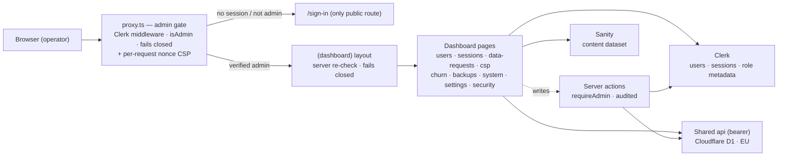

# Admin dashboard

> `@indiecrafts/web-surfaces-admin` — the internal operator console. Auth-gated, `noindex`, its own subdomain.

## Purpose

Admin is a separate Next.js app for operators, not the public. It is the one console
where a small team runs the platform: browse users, revoke sessions, review GDPR
data-subject requests, watch CSP and security feeds, read churn and backups, and edit
operational settings. Every screen is read-only or narrowly-scoped over the shared
backend; the few writes (grant admin, revoke sessions, save a setting) go through
re-authorized, audited server actions.

It shares the `website` stack — Next.js 16 (App Router) · React 19 · Tailwind v4 ·
shadcn/ui — and ships on platform class `next-cf` (Next → OpenNext → Cloudflare Workers).
It composes shared bricks (`packages-web-ui`, `packages-web-sanity`,
`packages-shared-security`, `packages-shared-auth`) and never reaches into a sibling app.

## Architecture



Every request enters through `src/proxy.ts`. It runs the Clerk middleware, checks the
session claims with `isAdmin`, and **fails closed** — no session, a non-admin claim, or an
unverifiable token redirects to `/sign-in`. The same pass stamps a strict per-request
nonce CSP. The proxy is coarse routing only, and middleware is bypassable (Next.js
CVE-2025-29927), so the real authorization runs **again server-side**: the `(dashboard)`
layout re-checks `isAdmin` before it renders `AppShell`, and every server action calls
`requireAdmin` before it writes.

Pages are React Server Components. They read their data at request time from three
sources: **Clerk** (users, live sessions, the admin role in `publicMetadata`), the
**shared api** over a bearer token (`API_URL` + `APP_API_TOKEN`) which fronts **Cloudflare
D1** in the EU, and **Sanity** for content. The bearer token stays server-side; the browser
never sees it. Every fetch degrades gracefully — a failed read renders an empty state or an
explicit error, never a crash.

## The dashboard

Every page lives under `src/app/[locale]/(dashboard)`, grouped in the sidebar by concern
(`src/user-interface/lib/nav.ts`). All reads are server-side; where a page writes, the write
routes through an audited server action, not a client call.

| Route            | What it does                                                                                           | Data source                                                                                                |
| ---------------- | ------------------------------------------------------------------------------------------------------ | ---------------------------------------------------------------------------------------------------------- |
| `/`              | Overview — one count card per section, plus the grant/revoke admin-role form                           | Shared api list counts (`/v1/sessions` · `/v1/data-requests` · `/v1/csp-reports` · `/v1/security`) + Clerk |
| `/users`         | Browse and search Clerk users; shows each user's marketing-email consent                               | Clerk `getUserList` + shared api `POST /v1/profiles/consent`                                               |
| `/sessions`      | Recent sign-ins across surfaces (last 100); revoke one or all                                          | Shared api `/v1/sessions?limit=100` (D1); revoke via Clerk action                                          |
| `/data-requests` | GDPR data-subject requests submitted through the site (last 100), read-only                            | Shared api `/v1/data-requests?limit=100` (D1)                                                              |
| `/erasure`       | Open GDPR erasure requests by deadline (breached · due soon · on track), no identifiers                | Shared api `GET /v1/erasure-requests` (D1)                                                                 |
| `/csp`           | Aggregated CSP violation groups, most frequent first; `report` vs `enforce` rows                       | Shared api `/v1/csp-reports?limit=100` (D1)                                                                |
| `/churn`         | Deletion-survey aggregates — total, by day, by reason, recent feedback                                 | Shared api `/v1/churn` (D1)                                                                                |
| `/backups`       | Bucket, retention, pre-migration flag, and recent backup runs, read-only                               | Shared api `/v1/backups/status`                                                                            |
| `/cron`          | Cron health (healthy · failed · stale · never ran), live counts, last 24 runs with per-pass results    | Shared api `GET /v1/cron/status` (`cron_runs` + live counts)                                               |
| `/system`        | Live version and health for every surface, worker, and database; the `cron` row shows its health badge | Surface `/api/version` · worker `/health` · api health (D1 · Sanity) · `/v1/cron/status`                   |
| `/settings`      | Operational retention, ops, and link-TTL settings; editable                                            | Shared api `GET /v1/settings`; save via `saveSetting` action → `PUT /v1/settings`                          |
| `/security`      | App-level security incidents (last 100), data-minimized; deep-link to the edge feed                    | Shared api `/v1/security?limit=100` (D1) + Cloudflare edge (`CLOUDFLARE_SECURITY_URL`)                     |

**Actions on those pages** (server actions in `monitoring-actions.ts` — each re-checks the admin role,
calls a bearer-gated api route and writes an admin audit event):

- **Erasure requests → Retry** a stuck (`confirmed`) request: the api reads the subject's email from
  Clerk, or asks the operator to type it (checked against the request's fingerprint, never stored).
  On success the subject gets the completion email. Audit `admin.erasure_retry`.
- **Erasure requests → Close manually** with a required note, for a request handled outside the
  system. Audit `admin.erasure_close`; the note shows on the closed row.
- **Scheduled jobs → Run now** runs one cron tick immediately. Audit `admin.cron_run`.

`/sign-in` is the one public route. Two API routes back the security baseline:
`/api/csp-report` (the CSP violation sink) and `/api/session-log` (session-log ingest).

## Auth gate

The gate is Clerk's `publicMetadata.role`, enforced in two layers and failing closed at
both.

- **Middleware (`src/proxy.ts`)** — `clerkMiddleware` reads the session claims and calls
  `isAdmin` (from `@indiecrafts/packages-shared-auth`). Anything but a verified admin claim
  redirects to `/sign-in`. This is coarse routing, not the trust boundary.
- **Data layer (`(dashboard)/layout.tsx`)** — every dashboard route re-checks `isAdmin`
  server-side before rendering. This is the real gate, because middleware is bypassable
  (Next.js CVE-2025-29927). Each server action (`grantAdmin`, `revokeAdmin`, `revokeSession`,
  `revokeUserSessions`, `saveSetting`) independently calls `requireAdmin`.

The role grant is the crown jewel. Sign-up is open and passwordless, so `grantAdmin` is the
only thing between a stranger and admin. It is admin-gated on the server, validates the
target id, writes an audit row, and — on revoke — kills the target's live Clerk sessions so
a demotion is immediate, not "eventually, when the token expires". Privileged actions log to
the shared audit sink (`src/lib/audit.ts`), which stores the actor id and edge country but
no IP (GDPR data minimization), with a durable console fallback so an audit is never lost.

**Before shipping.** An unconfigured Clerk (no `NEXT_PUBLIC_CLERK_PUBLISHABLE_KEY`) leaves
the middleware ungated — but the `(dashboard)` layout still fails closed and redirects to
`/sign-in`, so the operator screens stay locked, not exposed. Configure Clerk, then add a
Cloudflare Access gate on the subdomain as defense-in-depth before the app goes live.

## Wired baseline

- **i18n** — next-intl with the `[locale]` segment and `src/i18n/routing.ts` (`as-needed`
  prefixes). Strings live in `messages/<locale>.json` (`en` · `fr`); import `Link` and
  `redirect` from `@/i18n/routing`, never `next/link`.
- **CSP** — a strict per-request nonce policy set in `src/proxy.ts`
  (`@indiecrafts/packages-shared-security`), enforced by default. `CSP_MODE=report-only`
  rolls a surface back to observation; `CSP_TRUSTED_TYPES=report` opts into a Trusted-Types
  trial. Violations report to `/api/csp-report` and surface on the `/csp` page.
- **Sanity reads** — content comes through `@indiecrafts/packages-web-sanity` over the
  shared dataset; no write token ever reaches the client.
- **shadcn shell** — `src/user-interface/layout/`: `AppShell` → `AppSidebar` +
  `SidebarInset`/`AppHeader`, the grouped nav from `src/user-interface/lib/nav.ts`, and a
  no-flash light/dark `ThemeToggle`. Every page uses the same `PageHeader` + `Card`
  treatment with shadcn `Table`/`Badge`/`Input` and `sonner` toasts. These are app-owned
  components — no Storybook (its globs cover the design-system packages only).

## Deploy

```bash
pnpm deploy:web:admin:dev        # or :staging | :prod
```

Each command runs the shared `code/shared/scripts/deploy/next.mjs`, which builds the
OpenNext bundle (`build:cf`) and runs `wrangler deploy` for the env. `pnpm deploy:all:<env>`
includes admin in the fleet deploy.

Admin is one row in `code/shared/scripts/lib/apps.mjs` — slug `admin`, class `next-cf`,
platform `web`, kind `surface`, order `40`, dir `code/projects/web/surfaces/admin`, no smoke
probe. Cloudflare resource names derive from that row as `<prefix>-<env>-web-surfaces-admin`
(e.g. `indiecrafts-prod-web-surfaces-admin`), so a client rename only swaps the prefix. The
full deploy model lives in [platform-deploy](/shared/architecture/platform-deploy); the gate
is covered in [auth](/shared/architecture/auth).

## Source reference

Every source file has a generated per-file page under the Source reference tree at
`code/docs/reference/projects/web/admin/`. Start with the gate and the shell:

- [`src/proxy.ts`](/reference/projects/web/admin/src/proxy) — the middleware admin gate + CSP.
- [`src/lib/audit.ts`](/reference/projects/web/admin/src/lib/audit) — the privileged-action audit sink.
- [`src/user-interface/lib/nav.ts`](/reference/projects/web/admin/src/user-interface/lib/nav) — the sidebar groups and active-route logic.
- [`src/config/index.ts`](/reference/projects/web/admin/src/config/index) — the app-instance config home.

The `(dashboard)/layout.tsx` gate, the `(dashboard)/actions.ts` server actions, and each
page (`users`, `sessions`, `data-requests`, `csp`, `churn`, `backups`, `system`, `settings`,
`security`) each have their own page in that tree.
