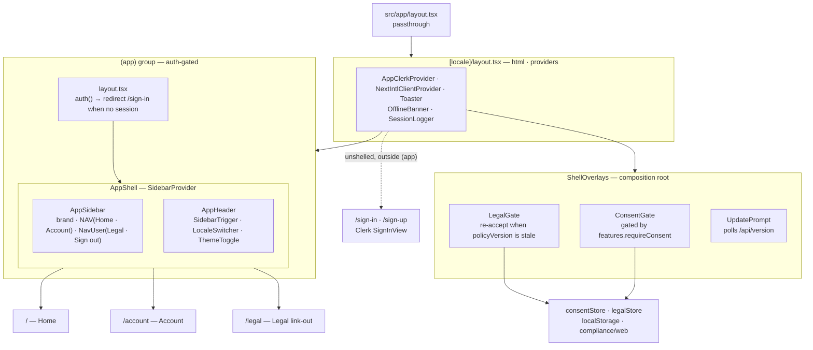

# App (lean web surface)

> Three pages behind a Clerk gate, in a shadcn sidebar shell, over the shared i18n / compliance / version baseline — `@indiecrafts/web-surfaces-app`.

## Purpose

`app` is a lean **authenticated** web surface. It wraps three pages — **Home**,
**Account**, and **Legal** — in a shadcn sidebar shell, and inherits the platform
baseline (i18n, compliance, version prompt) from the shared bricks.

It runs the same stack as `website` — Next.js 16 (App Router) · React 19 · Tailwind v4 ·
shadcn/ui · next-intl — on the `next-cf` platform class (Next → OpenNext → Cloudflare
Workers). Auth is **opt-in on the Clerk key**: set a key and every `(app)` route requires
a session; leave it unset and the surface runs as a public scaffold. That fail-open mode
is for local dev and keyless e2e only: the deploy refuses to ship `app` or `admin` without
the key (registry `requiredEnv`).

It is **not** a content surface — there is no CMS wired in. Add a content brick
(`@indiecrafts/packages-web-sanity` for reads, `@indiecrafts/packages-shared-security` for
headers) only when a real page needs it. Instance config — `features`, `consent`,
`policyVersion` — lives in `src/config/index.ts`.

## Architecture



**Walk-through.** The root `layout.tsx` is a passthrough; `[locale]/layout.tsx` owns the
`<html lang dir>` shell, the providers (`AppClerkProvider`, `NextIntlClientProvider`,
`Toaster`), and mounts `ShellOverlays`. Every route in the **`(app)` group** first passes
the group `layout.tsx` auth gate — with a Clerk key set, `auth()` redirects a signed-out
user to `/sign-in` (server-side defense-in-depth beyond the proxy) — then renders inside
`AppShell`. `AppShell` is the `SidebarProvider` composing `AppSidebar` (brand link, the flat
`NAV`, and the `NavUser` footer menu) with a `SidebarInset` that holds `AppHeader` and the
page. The three pages render in that inset. `ShellOverlays` is a thin composition root: it
mounts `ConsentGate`, `LegalGate`, and the version `UpdatePrompt`; the two compliance gates
read and write the shared `consentStore` / `legalStore` (`localStorage`, over
`compliance/web`). `sign-in` and `sign-up` sit **outside** the `(app)` group, so they render
unshelled — no sidebar, no header.

**Boundaries + skip link.** `(app)/loading.tsx` shows a status spinner inside the shell while
a page streams in. `[locale]/error.tsx` and `[locale]/not-found.tsx` are full-screen and
branded. `[locale]/layout.tsx` renders the shared `SkipLink` (`@indiecrafts/packages-web-ui-components`) as the first focusable element; every page
has a `<main id="main" tabIndex={-1}>` for it (the shell's `SidebarInset`, the auth pages, and
the error and 404 screens).

## Routes / pages

Everything lives under `src/app/[locale]`. Locale prefixes are `as-needed` (`/` and `/fr`).

| Route                                 | Page           | What it renders                                                                                                                                                                                                            |
| ------------------------------------- | -------------- | -------------------------------------------------------------------------------------------------------------------------------------------------------------------------------------------------------------------------- |
| `/`                                   | Home           | `PageHeader` + two link cards (Account, Legal) + `ShareButtons`. The description is an editor-owned Sanity welcome (`getAppWelcome`) that falls back to the message file.                                                  |
| `/account`                            | Account        | `<AccountControl variant="page">` — Clerk `<UserProfile>` with the Privacy & consent, Emails, Language + Your data tabs. `notFound()` unless `features.deleteAccount`, a Clerk key, and `NEXT_PUBLIC_API_URL` are all set. |
| `/legal`                              | Legal          | A list of the marketing site's legal pages, each opened cross-origin via `legalUrl(site.websiteUrl, …)` on a plain `<a>` — no content re-hosting.                                                                          |
| `/sign-in`, `/sign-up`                | Auth           | Clerk `SignInView` / sign-up. **Outside the `(app)` group — unshelled.** `notFound()` when Clerk is unconfigured.                                                                                                          |
| `/api/version`                        | build id       | JSON `{ version, commit }` with `no-store`; polled by the `UpdatePrompt` and used as the deploy smoke probe.                                                                                                               |
| `/api/csp-report`, `/api/session-log` | security sinks | CSP violation reports and session-log ingest.                                                                                                                                                                              |
| `/api/consent-log`                    | consent proof  | A signed-in user's cookie choice (banner or Privacy tab) → the api's `consent_events` (surface `app`). Signed out: `204`, nothing written.                                                                                 |

## Wired baseline

- **i18n — parity with `website`.** next-intl locale detection and redirection:
  `src/i18n/routing.ts` (`as-needed` prefixes, `localeDetection`, a namespaced locale cookie
  — no localized `pathnames` map yet), `src/i18n/request.ts` (messages from
  `messages/<locale>.json`, no Sanity overlay), and `src/proxy.ts`
  (`createMiddleware(routing)`). Import `Link` / `useRouter` / `redirect` from
  `@/i18n/routing`, never `next/link`. See
  [i18n &amp; routing](/projects/web/website/config/i18n-and-routing).
- **Auth — Clerk (`@clerk/nextjs`).** `AppClerkProvider` wraps the locale layout; the `(app)`
  group layout enforces the session server-side. `sign-in` / `sign-up` are public routes; the
  `NavUser` footer owns everyday **Sign out** (Clerk's `<UserProfile>` has none). All gated on
  the publishable key — no key, no session checks, and the auth UI 404s.
- **Compliance — overlays gated by `features.requireConsent` (off by default).**
  `ShellOverlays` mounts `ConsentGate` (the cookie banner) and `LegalGate` (the legal
  re-acceptance popup) over the shared `compliance/web` stores. The consent mode is
  geo-resolved from the edge `cf-ipcountry` header, and honours a server-read `Sec-GPC: 1`
  signal. Each decision — the banner's accept/reject/save, the geo auto-seed, a Privacy-tab
  save — is logged for a signed-in user through `/api/consent-log` (`reportConsent`), like the
  website's. Account delete and data export are separately gated by `features.deleteAccount` /
  `features.exportAccount` (each also needs Clerk + `NEXT_PUBLIC_API_URL`). Legal content is
  **not** re-hosted — `/legal` links out to the website. See
  [compliance](/packages/shared/compliance).
- **Version prompt.** `@indiecrafts/packages-web-version`'s `UpdatePrompt` polls
  `src/app/api/version/route.ts`, comparing against `src/lib/build-info.ts` (stamped by
  `scripts/version.mjs` during `build:cf`), and offers a reload when a new deploy ships while
  a tab is open.

## E2e

Playwright journeys (`e2e/journeys/`) run against a real `next build && next start` on a
**dedicated port `:3011`** so they never collide with the website's e2e server (`:3000`).
Run them with `pnpm e2e`; CI runs them in the `browser-e2e-app` job.

| Journey     | Asserts                                                                                                                                                         |
| ----------- | --------------------------------------------------------------------------------------------------------------------------------------------------------------- |
| `boot`      | `/en` returns 2xx and shows the app shell **or** the sign-in form.                                                                                              |
| `version`   | `GET /api/version` returns 200 with a string `version`.                                                                                                         |
| `not-found` | `test.fixme` — records a known gap: the app ships no `[locale]/not-found.tsx`, so an unknown route soft-returns 200, not a branded 404.                         |
| `sign-in`   | Clerk Testing Token flow — sign-in establishes a session, the gated `/account` stays reachable, sign-out clears it. **Self-skips** without the Clerk test keys. |

There is **no dataset seed** — the home's one Sanity read falls back to a message-file
string, so `global-setup` only fetches a Clerk Testing Token when the auth keys are wired.

## Deploy

```bash
pnpm deploy:web:app:dev          # or :staging | :prod
```

Each maps to the app's own `deploy:app:<env>` script, which runs the shared
`code/shared/scripts/deploy/next.mjs`. `pnpm deploy:all:<env>` includes `app` in the fan-out.

The registry has **one row** in `code/shared/scripts/lib/apps.mjs` — slug `app`, class
`next-cf`, platform `web`, kind `surface`, order `45`, dir `code/projects/web/surfaces/app`,
smoke probe `/api/version` (expects `version`). Every path resolver reads that `dir`, never a
hard-coded path. The full deploy model lives in
[platform-deploy](/shared/architecture/platform-deploy).

## Source reference

Per-file generated docs for every source file in this surface live under the auto-generated
**Source reference** tree at `reference/projects/web/app/` — the sidebar lists the whole
subtree; start at
[`app/next.config`](/reference/projects/web/app/next.config).
