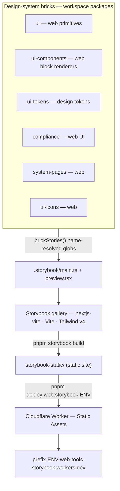

# Storybook — design-system gallery

> One browse-only gallery for every shared UI brick — flip the theme toolbar to see it all invert together.

## Purpose

`@indiecrafts/web-tools-storybook` is the **design-system reference** for indiecrafts.dev: a single
Storybook that renders the shared UI bricks so you can browse, read, and compare them before building.
It is a **leaf deployable** (`code/projects/web/tools/storybook`), not a shared brick — it _consumes_ the
bricks and ships no product code.

It documents the web bricks — `ui` primitives, `ui-components` block renderers, `ui-tokens`, plus
`announcement`, `locale-suggest`, `system-pages`, `ui-icons`, and the `compliance` web UI.

The sidebar is **one tree**: Introduction, Design Tokens, then the domain components, UI atoms last
(`storySort` in `.storybook/preview.tsx`).

The theme toolbar sets `data-theme` on `` `<html>` `` — exactly the attribute the token system keys on —
so one switch flips every color, the sidebar palette, shiki output, and the typeset at once.

## Architecture



**Walk-through.**

1. **Bricks own their stories.** Each `*.stories.tsx` sits beside its component inside the brick package
   — the gallery never re-homes them. Token docs are the exception: they live here as MDX under `stories/`.
2. **`brickStories()` resolves each brick by package name.** `.storybook/main.ts` calls
   `require.resolve("<pkg>/package.json")`, follows the pnpm workspace link to the brick's real directory,
   and emits a `configDir`-relative `src/**/*.stories.@(ts|tsx)` glob. So the globs survive this package
   moving anywhere in the tree — no relative paths to keep in sync.
3. **The gallery renders on `@storybook/nextjs-vite`.** Vite-fast, with `next/image` / `next/font`
   support and `experimentalRSC` so async React Server Components (`QuoteList`, `CodeBlock`) render.
   Tailwind v4 compiles through `@tailwindcss/vite`; addons `docs`, `themes`, `a11y`, and `vitest` are on.
4. **Next-coupled edges are mocked** (see [The decoupling rule](#the-decoupling-rule)) so the Vite gallery
   never pulls in the Next/CMS runtime.
5. **`storybook build` emits a static site** into `storybook-static/`.
6. **A Cloudflare Worker serves it** via Workers **Static Assets** (no Worker script — assets only),
   deployed per environment.

## What it documents

| Brick (package)                            | Renderer                   | What's shown                                                                                                            |
| ------------------------------------------ | -------------------------- | ----------------------------------------------------------------------------------------------------------------------- |
| `@indiecrafts/packages-web-ui`             | web                        | shadcn-derived primitives (Button, Input, …)                                                                            |
| `@indiecrafts/packages-web-ui-components`  | web                        | page-builder block renderers (Callout, GalleryCarousel, QuoteList, CodeBlock)                                           |
| `@indiecrafts/packages-web-announcement`   | web                        | the announcement-bar component                                                                                          |
| `@indiecrafts/packages-web-locale-suggest` | web                        | the locale-suggestion prompt                                                                                            |
| `@indiecrafts/packages-shared-compliance`  | web                        | compliance UI — `DeleteAccountSection` + `ChurnSurvey` (copy-injected, `next-intl`-free)                                |
| `@indiecrafts/packages-web-system-pages`   | web                        | the status pages (maintenance · 404 · error · offline)                                                                  |
| `@indiecrafts/packages-web-ui-icons`       | web                        | the icon set                                                                                                            |
| `@indiecrafts/packages-web-ui-tokens`      | tokens (MDX in `stories/`) | live `var(--token)` swatches — Colors, Sidebar & Charts, Type & Radius — plus an Adaptive & container-query resize demo |

## Run

Run from the repo root:

```bash
pnpm --filter @indiecrafts/web-tools-storybook storybook        # dev gallery → http://localhost:6006
pnpm --filter @indiecrafts/web-tools-storybook storybook:build  # static build → storybook-static/
pnpm --filter @indiecrafts/web-tools-storybook test:stories     # every story as a component + a11y test
```

`test:stories` runs `vitest run` — it executes every story as a Vitest browser-mode component test with
`@storybook/addon-a11y` running axe on each, **twice: in the Light and the Dark theme** (two Vitest projects;
contrast differs per theme). The preview sets `a11y: { test: "error" }`, so a violation fails the test (the
addon default only warns), and each setup file passes the addon's own annotations — without them axe never
runs. A story that must waive an axe rule for upstream markup it can't reach disables only that rule, with an
`@debt ACCESSIBILITY` comment. The **Locale** toolbar renders translated components (`GalleryCarousel`,
`QuoteList`) against the website's real `messages/en.json` / `fr.json`; a missing key logs a console error. It is the visual/interaction gate: it **blocks** the CI
`browser-stories` job. It is deliberately **not** in the default `pnpm verify`
— it needs a real browser, so it lives in its own Playwright-provisioned CI job, not the browserless gate.

## The decoupling rule

**Browse-only — the decoupling is the design.**

- The website **copies** a component out of the gallery, then adapts it to template conventions. It
  **never** imports `@indiecrafts/web-tools-storybook` or depends on it at runtime (root `CLAUDE.md` NEVER).
- Stories reference the **real bricks**, so the gallery never drifts from source.
- **Next-coupled edges are mocked**, because the gallery is Vite, not Next — mock the Next/CMS edges,
  don't pull them in. `.storybook/main.ts` aliases:
  - `next-intl` (+ `/server`, `/navigation`) → `next-intl-mock.tsx`, a static message map for the two
    translation-reading renderers (`GalleryCarousel` client, `QuoteList` server).
  - `shiki` → `shiki-mock.ts` — the WASM highlighter hangs in the browser canvas, so `CodeBlock` stories
    render against a stub (real highlighting stays server-side in the app).

## Deploy

`pnpm deploy:web:storybook:<env>` (`dev` · `staging` · `prod`) runs `storybook:build`, then the shared
`code/shared/scripts/deploy/worker.mjs` runner (`wrangler deploy --env <env>`).

- **Static-assets Worker, not Pages.** `wrangler.toml` declares no `main` — just `[env.<env>.assets]`
  pointing at `./storybook-static`. The Worker only serves the build.
- **Resource name** `` `<prefix>-<env>-web-tools-storybook` `` on `*.workers.dev`, or the
  `storybook.<root>` route once it is set in `domains.mjs`.
- **Registry peer.** The gallery has a row in `code/shared/scripts/lib/apps.mjs` — slug `storybook`,
  class `worker-cf`, platform `web`, kind `tool`, `order: 60` (deploys last; nothing depends on it). CI and
  the deploy runner fan out from that registry, so it rides the same Cloudflare deploy set as `api` / `cron`.

## Source reference

Per-file reference docs (mirroring `code/projects/web/tools/storybook/`) live under the auto-generated
**Source reference** sidebar tree at `/reference/projects/web/tools/storybook/` — including `.storybook/main`,
`.storybook/preview`, the mocks, and the Vitest configs.
