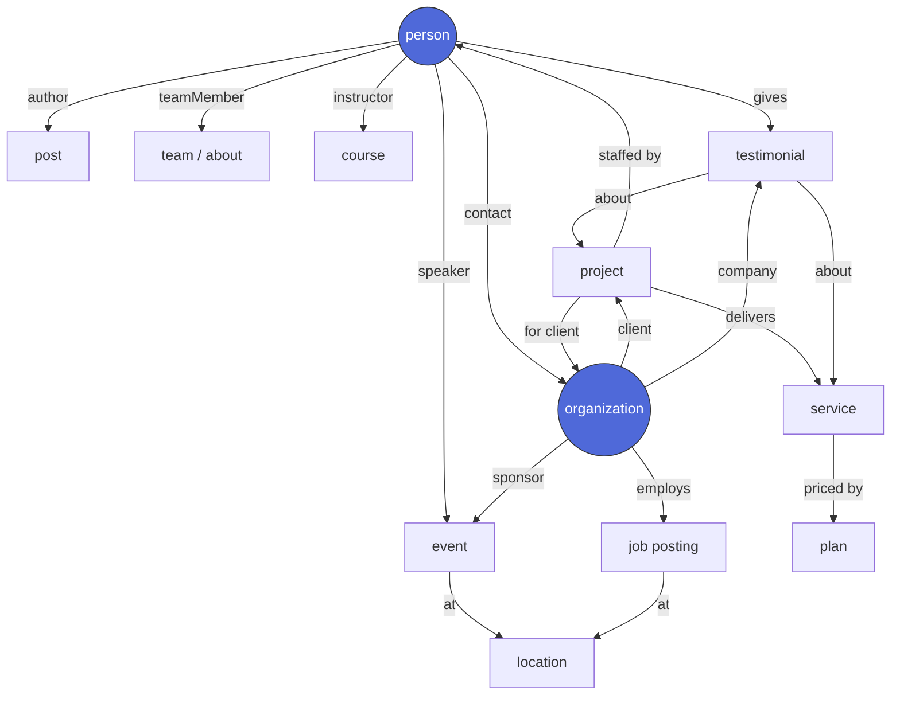

# Full-website template — Sanity structure, page builder & entities

_The complete content model to turn this template from "a blog + code-defined marketing
pages" into a **fully editor-driven website builder**: every page composed from reusable
blocks, every entity a proper document, all following Sanity content-modeling best
practices._

Sources: [Sanity Learn — Page building](https://www.sanity.io/learn/course/page-building) ·
[An introduction to page builders](https://www.sanity.io/learn/course/page-building/an-introduction-to-page-builders) ·
[Content modeling best practices](https://officialskills.sh/sanity-io/skills/content-modeling-best-practices) ·
[Localization](https://www.sanity.io/docs/studio/localization) ·
[document-internationalization — singletons](https://github.com/sanity-io/document-internationalization/blob/main/docs/01-singleton-documents.md) ·
[Roboto Studio — page-builder guide](https://robotostudio.com/blog/the-only-sanity-page-builder-guide-youll-ever-need).

> **Status:** **Pack 0 core shipped.** The page-builder is extracted to
> **`@indiecrafts/page-builder`** (16 generic block schemas + `blockContent`/`link`/`cta` +
> `quote`/`person` entities + `MODULES_FRAGMENT` + `pageBuilderSanity` barrel — see
> `docs/packages/page-builder.md`); a generic **`page` document** + the
> **`/[locale]/[...slug]`** route are live (SEO metadata via `buildMetadata` + sitemap +
> JSON-LD `WebPage`); a **`lead-magnet`** block ships (capture → gated delivery
> via `@indiecrafts/gated-delivery`); and the **`homePage` singleton is retired — the home is
> now a `page` (`isHome`), so there is ONE page model everywhere.** **Still proposal:** the new
> marketing blocks (§5a), reference blocks (§5b), Presentation, `llms.txt` for pages, and the
> marketing entities (§3 / §3G). Read §8 for remaining gaps and §13 for build order.

## Contents

- **§0** Governing principles (best practices) · **§1** What exists today
- **§2** Pages · **§3** Entities (content packs) · **§3G** The identity graph (roles, not silos) · **§4** Reusable objects
- **§5** The page builder (blocks) · **§6** Renderers · **§7** Studio structure
- **§8** Gaps vs today · **§9** Phased packs · **§10** Reserved-module alignment
- **§11** Page templates (3 meanings) · **§12** Platform layer (what makes it great)
- **§13** Recommended build order + Pack 0 concrete spec · **§14** WordPress parity & deliberate omissions

---

## 0. The governing principles (Sanity best practices, applied)

1. **Model by meaning, not by layout.** Entities (`project`, `service`, `testimonial`)
   are documents that describe _what a thing is_. Pages _compose_ them. Never a
   page-shaped schema where "the testimonials on the homepage" is a field — that traps
   content and breaks reuse across channels.
2. **Objects vs references — the core decision.**
   - **Inline object** = presentational, single-use, trapped in its page, cheapest to
     query. → page-builder _section blocks_ (`hero`, `cta-banner`, `media-text`).
   - **Reference** = shared entity, reused across pages, resolved in GROQ. → _reference
     blocks_ (`featured-projects` → `project` docs).
   - Rule of thumb: **if two pages could show it, it's a document.**
   - **Model identity once, express role by reference.** A human is not an "author" _or_ a
     "team member" _or_ a "client" — those are **roles the same `person` plays**. One identity
     doc, referenced from many contexts (+ optional role-scoped fields), never a copy per role.
     Same for an `organization` (client · partner · sponsor). This turns the content into a
     **graph, not silos** — the highest-leverage modeling decision here. See **§3G**.
3. **Document-level i18n** via `@sanity/document-internationalization` (already used by
   `post`): every translatable doc carries a `language` field + translation references;
   reference selectors filter by language. Config singletons stay field-level (per-locale
   `localeString`, as `siteMeta` already does).
4. **Reuse the object library everywhere** — `metadata` (slug/excerpt/social),
   `seoMeta`, `link`, `cta`, `blockContent`. Don't re-invent per doc.
5. **Singletons** = fixed document IDs + Structure links + create/delete disabled
   (`siteSettings`, `siteMeta`, `navigation`, `cookieConsent` already do this; add
   `homePage`).
6. **Decouple schema from render.** Schemas own the refs; renderers
   (`@indiecrafts/ui-components`) take **resolved** data and stay pure. The composable
   `BLOCK_RENDERERS` registry already models this — each page type spreads the base +
   its own blocks.
7. **Validation is content quality** — required `title`/`slug`, **image `alt` required**
   (a11y), max lengths on SEO fields, `datetime` on events, unique slug per locale.
8. **Visual editing** — mount Sanity **Presentation** (click-to-edit overlays) on the new
   page routes; draft-mode plumbing already exists.

---

## 1. What exists today (the honest baseline)

**Core (app, feature-independent) — `code/projects/web/surfaces/website/src/sanity/schema`**

- Singletons: `siteSettings` (brand · analytics · verification), `siteMeta` (per-locale
  SEO defaults + `pageSeo[pageId]` map), `navigation` (header/footer menus),
  `cookieConsent`. Multi-doc: `legalPage` (5 legal pages).
- Objects: `pageSeo`, `globalSchema`, `navItem`, `localeString`, `cookieCategory`,
  `cookieEntry`.

**Blog module — `code/modules/blog/src/sanity/schema`**

- Documents: `post` (i18n via `language`), `author`, `category`, `tag`, `person`,
  `quote`, `blog` (index config).
- Objects: `blockContent`, `metadata`, `seoMeta`, `link`, `cta`.
- **Page-builder blocks (object types)** — 10 generic + 3 blog-specific:
  `accordion-list · callout · card-list · custom-html · gallery · person-list · prose ·
quote-list · stat-list · step-list` + `blog-index · blog-post-list · blog-post-content`.
- Renderers: the 10 generic live in `@indiecrafts/ui-components`; the 3 blog ones in the
  module. Composed via `{ ...BLOCK_RENDERERS, ...blog }`.

**The critical gap:** the page-builder **mechanism exists but is only mounted inside blog
post bodies** (+ the homepage `BlocksShowcase` demo). Marketing pages are **code routes +
`messages/<locale>.json` copy**, not Sanity documents. There is **no `page` document**,
**no catch-all page route**, and **no marketing entities** (project/service/testimonial/…).

---

## 2. Pages — the routable surface of a full site

| Page                                            | Backed by                                    | Route                           | Status                   |
| ----------------------------------------------- | -------------------------------------------- | ------------------------------- | ------------------------ |
| **Home**                                        | `page` doc with `isHome` (`sections[]`)      | `/`                             | ✅ done (one page model) |
| **Generic marketing page**                      | `page` doc (`sections[]` + slug)             | `/[[...slug]]` catch-all        | ✳ **the core new piece** |
| About / Contact / Landing / Legal-marketing     | `page` docs                                  | `/about`, `/contact`, …         | ✳ via `page`             |
| **Blog** index + post + author + category + tag | `blog`, `post`, `author`, `category`, `tag`  | `/blog/**`                      | ✓ exists                 |
| **Work** index + case study                     | `project`                                    | `/work`, `/work/[slug]`         | ✳ new                    |
| **Services** index + detail                     | `service`                                    | `/services`, `/services/[slug]` | ✳ new                    |
| **Products** index + detail                     | `product` (+ `productCategory`)              | `/products/**`                  | ✳ new (shop module)      |
| **Events** index + detail                       | `event`                                      | `/events`, `/events/[slug]`     | ✳ new                    |
| **Locations** index + detail                    | `location`                                   | `/locations/**`                 | ✳ new                    |
| **Team / People**                               | `person` (team)                              | `/team` (or a `page`)           | ✳ new                    |
| **Pricing**                                     | `page` + `pricing-table` block → `plan` docs | `/pricing`                      | ✳ new (today: code)      |
| **FAQ / Help center**                           | `faq` docs (+ `article` for KB)              | `/faq`, `/help/**`              | ✳ new (today: messages)  |
| **Directory**                                   | `listing` docs + `taxonomy`                  | `/directory/**`                 | ✳ new                    |
| Legal (5)                                       | `legalPage`                                  | `/mentions-legales`, …          | ✓ exists                 |
| System (404, maintenance, studio)               | code                                         | —                               | ✓ exists                 |

**Routing rule:** the catch-all `/[[...slug]]` resolves a `page` by localized slug;
reserved first-segments (`blog`, `work`, `services`, `studio`, `api`, …) are excluded so
entity routes win. Slugs unique per locale; a reserved-slug guard in validation.

---

## 3. Entities (documents) — the content packs

Grouped by domain. Each doc carries `language` (i18n) + reusable `metadata` + `seoMeta`
unless noted. ✓ exists · ✳ new · ↑ extend existing.

### Editorial (exists)

| Doc                                 | Fields (core)                                                             | Notes                                               |
| ----------------------------------- | ------------------------------------------------------------------------- | --------------------------------------------------- |
| `post` ✓                            | title · excerpt · author→ · categories[]→ · tags[]→ · body(PT) · metadata | i18n                                                |
| `author` ✓ / `category` ✓ / `tag` ✓ | name/title · slug · image · bio                                           | taxonomy shared below                               |
| `person` ✓↑                         | name · role · bio · image · social[]                                      | **extend → team member** (department, order)        |
| `quote` ✓↑                          | content · author · role · image                                           | **generalize → `testimonial`** (+ rating, company→) |

> **Done (desk-level):** the Studio now surfaces `quote` / `person` as **top-level** domains
> **Témoignages** / **Équipe** (`blogStructure`), out of the old nested "Références" — matching §7.
> The **field generalization + `/team` route + shared-home extraction** below remain **Pack 1**.

### People & social proof (new)

| Doc                                                    | Fields                                                                                                                                                | Powers                                                                                                                                                                                                        |
| ------------------------------------------------------ | ----------------------------------------------------------------------------------------------------------------------------------------------------- | ------------------------------------------------------------------------------------------------------------------------------------------------------------------------------------------------------------- |
| `testimonial` ✳ (from `quote`)                         | quote · author · role · `company`→ · rating · avatar                                                                                                  | testimonial blocks, JSON-LD Review                                                                                                                                                                            |
| `client` / `partner` ✳                                 | name · logo(mono+color) · url · tier                                                                                                                  | logo-wall, directory, `company` refs                                                                                                                                                                          |
| `caseStudy` = **`project`** (recommended, don't split) | the case-study fields live **on `project`**: `client`→ · `challenge` · `solution` · `results[]`(stat) · `testimonials[]`→ · `gallery` · `services[]`→ | proof + portfolio at `/work/[slug]`. Split into a separate `caseStudy` doc **only** if "portfolio piece" and "written case study" are genuinely different content types for the client — usually they aren't. |

### Portfolio & offerings (new)

| Doc                        | Fields                                                                                                                                                                                                   | Route                                                                                                                                |
| -------------------------- | -------------------------------------------------------------------------------------------------------------------------------------------------------------------------------------------------------- | ------------------------------------------------------------------------------------------------------------------------------------ |
| `project` ✳ (= case study) | title · client→ · services[]→ · summary · **`challenge` · `solution`** · body(PT) · gallery · `results[]`(stat) · `testimonials[]`→ · date · `featured`                                                  | `/work/[slug]` — **is the case study**                                                                                               |
| `service` ✳                | title · icon · summary · body(PT) · price→ · faqs[]→ · relatedProjects[]→                                                                                                                                | `/services/[slug]`                                                                                                                   |
| `feature` ✳ (capability)   | title · slug · icon · summary · body(PT) · media/screenshots · `category`→ · `related[]`→feature · order · featured                                                                                      | **`/features`** + **`/features/[slug]`** — the reusable capability: shown in the grid, on its own page, **and** inside pricing tiers |
| `plan` (pricing) ✳         | name · price · interval · **`features[]`** (`planFeature`: `feature`→ · included · note) · cta · highlighted                                                                                             | pricing-table block                                                                                                                  |
| `product` ✳                | title · **`type`(physical \| digital)** · `price`(→`price` obj, i18n) · variants[] · gallery · category→ · specs · **physical:** shipping · weight · stock; **digital:** file→ · license · downloadLimit | shop (`/products`) — **checkout routes by `type`: physical → Stripe, digital → LemonSqueezy** (see Payments note below)              |
| `bundle` ✳                 | title · summary · **`items[]`→ (`service` \| `product`, mixed)** · pricing (`bundlePrice`→`plan` \| inline · `compareAt` for the savings) · `badge` · gallery                                            | groups offerings into a package — `/bundles/[slug]` or a highlighted card in `service-grid`/`product-list`                           |

> **Bundling is a cross-offer pattern, not a product hack.** A `bundle` groups **mixed
> `service` + `product` refs** into one priced package (`compareAt` shows the saving). Where else
> it makes sense — model as the same shape, not new types: **`event`** → a _series/pass_ (bundle
> of event refs); **`course`** → a _track/curriculum_ (bundle of lessons/courses); **`plan`** → a
> tier that _is_ a bundle of `feature`s. Keep bundling a **reference array + a price**, so any
> offering entity can adopt it without a bespoke schema.

### Commerce & pricing (new)

| Doc                        | Fields                                                                                                                                                   | Powers                                                                                                                                                                                                                                           |
| -------------------------- | -------------------------------------------------------------------------------------------------------------------------------------------------------- | ------------------------------------------------------------------------------------------------------------------------------------------------------------------------------------------------------------------------------------------------ |
| `market` / `region` ✳      | `code`(eu/us/uk) · `label` · `currency`(ISO 4217) · **`locales[]`** (which site locales resolve to this market) · `taxRate` · `taxIncluded` · `default?` | **internationalised pricing** — every `price.byMarket` resolves here; render picks the market for the active locale (or geo/cookie), falls back to `default`, formats via `@indiecrafts/format` (locale `currency` is already on `i18n.locales`) |
| `promotion` / `discount` ✳ | `code` · `type`(percent\|fixed) · `value` · `validFrom/To` · **`appliesTo[]`→ `service`/`product`/`bundle`/`event`** · `byMarket?`                       | discount badge on the offering + a checkout price rule; optionally scoped per market                                                                                                                                                             |

> **Pricing is a `price` object, never a scalar.** Replace every `price`/`amount` field on
> `plan`/`product`/`bundle`/`event` with the shared `price` object (§4: `base: money` +
> `byMarket[]`). One offering, one price object, N market amounts — the display currency + tax
> come from the resolved `market`, so adding a market is a doc, not a schema change.

> **Payments route by type — two providers.** **Physical** goods → **Stripe** (Checkout + shipping
>
> - per-`market` tax). **Digital** goods (files · licenses · webinar/event access) → **LemonSqueezy**,
>   a **Merchant of Record** — it collects + remits global VAT/sales-tax and delivers the file, so the
>   site never owns tax compliance. `payment.provider` (`stripe` \| `lemonsqueezy`) is chosen by the
>   order's line `type`; both **webhook back** to flip `payment.status` + fulfil the `order`/`booking`.
>   Reserved **`billing`** package; provider-hosted checkout only — never store card data. This pairs
>   with the `market`/`price` model: LemonSqueezy handles digital tax across markets; Stripe handles
>   physical shipping + tax per market.

### Knowledge, help & FAQ (new)

| Doc              | Fields                                           | Powers                                                                 |
| ---------------- | ------------------------------------------------ | ---------------------------------------------------------------------- |
| `faq` ✳          | question · answer(PT) · category→ · order        | faq blocks + **`FAQPage` JSON-LD** (already have `buildFAQPageSchema`) |
| `article` (KB) ✳ | title · body(PT) · category→ · relatedArticles[] | `/help/**` search + list                                               |

### Learning & training (new)

| Doc                             | Fields                                                                                                                                                                                                                                                                                              | Route                                                              |
| ------------------------------- | --------------------------------------------------------------------------------------------------------------------------------------------------------------------------------------------------------------------------------------------------------------------------------------------------- | ------------------------------------------------------------------ |
| `course` ✳ (= training / class) | title · slug · **`delivery`(self-paced \| live-class \| cohort \| 1:1-coaching \| group-coaching)** · **`format`(online \| in-person \| hybrid)** · summary · body(PT) · `instructor`/`coach`→person · `lessons[]`→ · `sessions[]`→ (live cohorts) · `price`→ · `enrollmentForm`→form · `category`→ | `/training` + `/training/[slug]`, `Course` JSON-LD                 |
| `lesson` ✳                      | title · `course`→ · order · video/`content`(PT) · duration · `free`(preview)                                                                                                                                                                                                                        | inside a course — drip / gated                                     |
| `enrollment` ✳ (submission)     | course→ · person→/email · status · progress · `payment`?→ · createdAt                                                                                                                                                                                                                               | signup — `booking`'s sibling; paid → LemonSqueezy (digital access) |

> **Online training + coaching reuse `course`, they aren't new types.** A **live online class** =
> `delivery:"live-class"` + `format:"online"` + `sessions[]` (each a webinar `event`/`session`). A
> **cohort** = `delivery:"cohort"` + a start date + `sessions[]`. **Coaching** (1:1 or group) =
> `delivery:"…-coaching"` + a **`booking` form** to book a session with the `coach`→person — so
> coaching is a `course` + `booking` + `person`, no bespoke schema. Self-paced = `lessons[]` only.

### Place & time (new)

| Doc                      | Fields                                                                                                                                                                                                                                                                                                                                                                                  | Powers                                                                                                                                                                                                                                                                                                                                                                                                     |
| ------------------------ | --------------------------------------------------------------------------------------------------------------------------------------------------------------------------------------------------------------------------------------------------------------------------------------------------------------------------------------------------------------------------------------- | ---------------------------------------------------------------------------------------------------------------------------------------------------------------------------------------------------------------------------------------------------------------------------------------------------------------------------------------------------------------------------------------------------------- |
| `location` ✳             | name · `address`(obj) · `geopoint` · `openingHours`(obj) · phone · email                                                                                                                                                                                                                                                                                                                | `/locations/**`, map block, `LocalBusiness` JSON-LD                                                                                                                                                                                                                                                                                                                                                        |
| `event` ✳                | title · **`format`(in-person \| hybrid \| `online`/`webinar`)** · start/end(datetime) · `location`→ **or** `streamUrl` + `recording`→ (webinar) · `speakers[]`→person · `sponsors[]`→org · **`services[]`→ · `products[]`→ · `testimonials[]`→ · `related[]`→event** (series/sessions) · `ticketTypes[]`(→`price`) · `capacity` · `registration`(none \| rsvp \| paid) · body(PT) · ics | `/events/[slug]`, `Event` + `eventAttendanceMode` JSON-LD, **calendar view**, **bookings**. A **webinar** is just `format:"online"` — no new type.                                                                                                                                                                                                                                                         |
| `booking` ✳ (submission) | event→ · `ticketType`→ · name · email · `qty` · `status`(pending/confirmed/cancelled) · `payment`→ (if paid) · `joinToken` · createdAt                                                                                                                                                                                                                                                  | **event + webinar registration** — one submission for RSVP · ticket · **webinar signup**. Reserved **`booking`** module: submit API + spam guard + capacity check + notify. **Confirm delivers by `event.format`:** in-person → ticket/QR; **online/webinar → the `streamUrl` (per-registrant `joinToken`) + `.ics` + reminder emails.** Paid webinar → LemonSqueezy (digital access); paid seat → Stripe. |
| `listing` (directory) ✳  | name · taxonomy[]→ · url · logo · description                                                                                                                                                                                                                                                                                                                                           | `/directory/**` (third-party entries — distinct from own `location`)                                                                                                                                                                                                                                                                                                                                       |

### Forms (**the biggest omission — flagged in the old draft**)

| Doc      | Fields                                                                                                                                                                                                                           | Notes                                                                                                                                                                                             |
| -------- | -------------------------------------------------------------------------------------------------------------------------------------------------------------------------------------------------------------------------------- | ------------------------------------------------------------------------------------------------------------------------------------------------------------------------------------------------- |
| `form` ✳ | **`type`(contact \| booking \| quote)** · title · fields(`formField`[]) · submitLabel · successMessage · notifyEmail · action(native/Resend/Formspree) · **booking:** `slots`/`availability` · duration · capacity · `payment`?→ | the `module.form` block **and** an entity's `form`→ ref (below). A **contact form** → a `contactMessage`/`formSubmission`; a **quote form** → a `quoteRequest`; a **booking form** → a `booking`. |

> **Decided (approved plan — near-term).** The first cut ships **three concrete inline form blocks** —
> `module.contact-form` · `module.booking-form` · `module.quote-form` — on the **existing `withGuard`
> spine** (newsletter/waitlist pattern: honeypot + `tooFast` + Turnstile → validate → `writeClient.create`
> → best-effort `sendEmail`), housed in one new `code/modules/contact-forms/` module (docs `contactMessage`
> · `booking` · `quoteRequest`). **Booking is request-only** — a preferred date/time (native `<input
type="date">`/`type="time">`) → a `booking` doc + owner alert + requester confirm; the owner confirms
> manually. The full **slot/availability/capacity/payment** booking (this row's booking fields) + the
> generalized `form`/`formField` builder-entity are **deferred to Pack 4/5b** — the near-term blocks are
> fixed-field, not the dynamic `form` doc. A Cal.com/Calendly `module.booking-embed` is a documented alt.
> | `formSubmission` ✳ | form→ · `entity`→ (what it was submitted from) · values(obj) · createdAt · meta | native → API route + spam guard (honeypot/turnstile) + `logger` + notify; **or** POST to an external provider |

> **Eligible entities carry a `form`→** — attach a **booking** or **contact/enquiry** form where a
> page invites action: `service` (request a quote / book), `event` + **webinar** (register →
> `booking`), `course` (enrol → `enrollment`), `person` (book a call with a consultant / team member),
> `location` (book an appointment), `product` (pre-order / enquiry). One `form` doc, reused across
> entities; the submit routes by `form.type` → `booking` (slot + capacity + optional `payment`) or
> `formSubmission`. **Not eligible** — pure content (`post`, `article`, `faq`): they take a
> `module.form` block on the page, no standing ref.

### Company / global (new)

| Doc                         | Fields                                                                                                                                                                                            | Notes                                                                                                                                 |
| --------------------------- | ------------------------------------------------------------------------------------------------------------------------------------------------------------------------------------------------- | ------------------------------------------------------------------------------------------------------------------------------------- |
| `companyInfo` ✳ (singleton) | **Golden Circle: `why`(purpose) · `how`(approach) · `what`(offering)** · mission · vision · **`values[]`** (`value`: title·description·icon) · foundedYear · stats[] · timeline[] · socialLinks[] | feeds About (why/how/what + mission + values) + the `module.values` / `module.golden-circle` blocks + footer + `Organization` JSON-LD |

### Taxonomy (generalize)

`category` ✓↑ (add optional `parent`→ for hierarchy) + `tag` ✓ become **shared taxonomy**
usable by `project`/`service`/`product`/`faq`/`listing` — or per-domain taxonomies where
vocabularies must not mix. Best practice: **hierarchical categories, flat tags.**

---

## 3G. The identity graph — roles, not silos (the polymorphic model)

The single highest-leverage decision in this whole plan. **The same human is an author on a
blog post, a team member on `/about`, a speaker at an event, the contact for a client, and the
voice of a testimonial — all at once.** Model that human as **one `person` document**, and
express each of those as a **role played by reference**, never a copy per context. Same for an
`organization` (one company that is a client here, a partner there, a sponsor at an event).

> **Anti-pattern (the current §3 draft):** separate `author`, `person`, `client`, `partner`,
> `quote` docs. A person who writes a post _and_ is a client contact _and_ gave a testimonial
> becomes **three unlinked records** — rename their photo in three places, and search never
> knows they're the same human. **Silos, not a graph.**

### 3G.1 · Two identity super-entities (the hubs everything references)

| Doc                                               | Is                  | Plays (facet)                                                                       | Never                     |
| ------------------------------------------------- | ------------------- | ----------------------------------------------------------------------------------- | ------------------------- |
| **`person`** ✳ (absorbs `author`)                 | one human           | `author` · `teamMember` · `speaker` · `instructor` · `contact` · `testimonialVoice` | duplicated per role       |
| **`organization`** ✳ (absorbs `client`/`partner`) | one company / group | `client` · `partner` · `sponsor` · `vendor` · `self` (the site owner)               | a logo trapped in a block |

Both are **plain reference targets** — authored once in **People** / **Organizations**, pulled
into any context by a `reference`. A role is `person.roles[]` (a checkbox set) **plus** the
edges pointing _at_ it. Role-specific fields live in **collapsed field groups** that show only
when the matching role is ticked (author → byline + author bio + author-page slug; team →
department + seniority + order; speaker → talk title + session).

### 3G.2 · The graph



Read it as: **`person` + `organization` are the two hubs; every content doc is a spoke that
references them by role.** The testimonial isn't a person — it's a **join** that links a
`person` (who said it) + their `organization` (where they work) to the `project`/`service`
it praises. _(The graph above is the teaching view; the **full reference map** below adds every
edge — offerings, commerce, submissions. Rendered visual: the "Indiecrafts Content Graph" artifact.)_

```mermaid
flowchart LR
  person((person)):::id
  org((organization)):::id
  post[post]:::content
  project[project]:::content
  service[service]:::content
  product[product]:::content
  bundle[bundle]:::content
  event[event]:::content
  course[course]:::content
  job[jobPosting]:::content
  location[location]:::content
  article[article]:::content
  faq[faq]:::content
  page[page / homePage]:::content
  company[companyInfo]:::config
  category[category]:::tax
  tag[tag]:::tax
  plan[plan]:::commerce
  payment[payment]:::commerce
  promo[promotion]:::commerce
  market[market / region]:::commerce
  tst[testimonial]:::join
  comment[comment]:::sub
  booking[booking]:::sub
  order[order]:::sub
  jobapp[jobApplication]:::sub
  form[form]:::content
  resource[resource]:::content
  ticketType[ticketType]:::commerce
  session[session]:::content
  feature[feature]:::content
  lesson[lesson]:::content

  post -->|authors| person
  project -->|team| person
  event -->|speakers| person
  course -->|instructor| person
  service -->|lead| person
  tst -->|voice| person
  person -->|contact @| org
  project -->|client| org
  event -->|sponsors| org
  tst -->|company| org
  company -->|self| org
  order -->|customer| org
  post -->|categories| category
  post -->|tags| tag
  project -->|services| service
  project -->|proof| tst
  service -->|plans| plan
  service -->|faqs| faq
  service -->|related| project
  product -->|category| category
  product -->|reviews| tst
  bundle -->|items| service
  bundle -->|items| product
  bundle -->|price| plan
  promo -->|% off| service
  promo -->|% off| product
  promo -->|% off| bundle
  promo -->|% off| event
  plan -->|per market| market
  product -->|per market| market
  bundle -->|per market| market
  promo -->|by market| market
  event -->|at| location
  event -->|ticket| plan
  event -->|covers| service
  event -->|sells| product
  event -->|proof| tst
  event -->|series| event
  job -->|at| location
  faq -->|category| category
  article -->|category| category
  tst -->|about| project
  tst -->|about| service
  category -->|parent| category
  page -->|blocks: ref any| project
  comment -->|on| post
  comment -->|on| page
  booking -->|for| event
  booking -->|pays| payment
  order -->|of| product
  order -->|pays| payment
  jobapp -->|for| job
  jobapp -->|is| person
  service -->|enquiry / book| form
  person -->|book a call| form
  location -->|appointment| form
  event -->|register| form
  course -->|enrol| form
  booking -->|via| form
  resource -->|gate| form
  resource -->|captures| person
  event -->|tiers| ticketType
  event -->|agenda| session
  session -->|by| person
  ticketType -->|priced| market
  plan -->|includes| feature
  product -->|has| feature
  service -->|has| feature
  feature -->|category| category
  course -->|lessons| lesson
  course -->|sessions| session

  classDef id fill:#4f69d9,stroke:#31459c,color:#fff;
  classDef content fill:#eef1fb,stroke:#9aa8e0,color:#1f2740;
  classDef join fill:#fbeecf,stroke:#d9b25f,color:#4a3a10;
  classDef sub fill:#edeff3,stroke:#b6bdc9,color:#3a4150;
  classDef tax fill:#e5f4ea,stroke:#7cc496,color:#1e4a30;
  classDef commerce fill:#f3ebfa,stroke:#b58fd0,color:#3d2a52;
  classDef config fill:#eaedf2,stroke:#aab2c0,color:#333a49;
```

<details><summary><b>Full reference map</b> — every entity + every edge (click to expand)</summary>



**Off the graph (deliberately):** `subscriber` · `waitlistEntry` · `formSubmission` reference
nothing (standalone lists); config singletons (`siteSettings` · `siteMeta` · `navigation` ·
`cookieConsent` · `uiMessages`) configure the site, not the content. **Now modeled:**
`promotion`/`discount` (`code · type(%\|fixed) · value · validFrom/To · appliesTo[] → service |
product | bundle | event`) **and internationalised pricing** — a `market`/`region` doc
(`currency · locales[] · taxRate`) that every priced entity (`plan` · `product` · `bundle` ·
`event` ticket) resolves against via a `price` object (`money` = amount + currency; base +
per-market overrides), formatted by `@indiecrafts/format` (locale `currency` already on
`i18n.locales`). **Genuinely still open:** just `redirect` (§12.6, slug renames).

</details>

### 3G.3 · Master entity matrix — every entity, its roles, its pages, its modules ("the gym")

Legend: **Kind** — 🟦 identity · 📄 content (own route) · 🔗 join · 📥 submission (no page) ·
⚙️ config · 🏷 taxonomy. `→` = reference out · `←` = referenced by.

**🟦 Identity — referenced everywhere, multi-role**

| Entity         | Plays                                                              | Own page                       | Rendered by (modules)                        | Key edges                                                                                              |
| -------------- | ------------------------------------------------------------------ | ------------------------------ | -------------------------------------------- | ------------------------------------------------------------------------------------------------------ |
| `person`       | author · team · speaker · instructor · contact · testimonial-voice | `/team`, `/blog/author/[slug]` | `team` · `author-bio` · `speaker-list`       | ← post.authors · project.team · event.speakers · course.instructor · testimonial.person · service.lead |
| `organization` | client · partner · sponsor · vendor · self                         | `/clients` or a `page`         | `logo-wall` · `client-list` · `partner-grid` | ← project.client · testimonial.company · event.sponsors · jobPosting.dept · person.contact-of          |

**📄 Content — its own route, references the identities**

| Entity                  | Module (list → detail)                          | → references                                                 | Reserved module    |
| ----------------------- | ----------------------------------------------- | ------------------------------------------------------------ | ------------------ |
| `post` ✓                | `blog-post-list` → `PostDetail`                 | author→person · categories[] · tags[]                        | blog (live)        |
| `project` / `caseStudy` | `featured-projects` → `ProjectDetail`           | client→org · team[]→person · services[]→ · testimonials[]→   | core / crm         |
| `service`               | `service-grid` → `ServiceDetail`                | lead→person · plans[]→ · faqs[]→ · relatedProjects[]→        | services           |
| `product`               | `product-list` → `ProductDetail`                | category→ · variants · reviews[]→testimonial                 | shop               |
| `bundle`                | `bundle-grid` → `BundleDetail`                  | items[]→ (service \| product) · bundlePrice→plan             | shop / services    |
| `event`                 | `event-list` / `event-calendar` → `EventDetail` | speakers[]→person · sponsors[]→org · location→ · ticket→plan | events             |
| `course` / `lesson`     | `course-list` → `CourseDetail`                  | instructor→person · lessons[]                                | learning           |
| `jobPosting`            | `job-list` → `JobDetail`                        | department · location→ · applications[]←                     | jobs               |
| `location`              | `location-list` / map → `LocationDetail`        | address · geopoint · hours (hosts events + team)             | core               |
| `article` (KB)          | `article-list` → `ArticleDetail`                | category→ · related[]→                                       | support            |
| `faq`                   | `faq` (+ FAQPage JSON-LD)                       | category→                                                    | core               |
| `plan`                  | `pricing-table`                                 | features[]                                                   | services / billing |
| `page` / `homePage`     | `page.sections[]` (the builder)                 | any block / any ref                                          | core (Pack 0)      |

**🔗 Join — links identities to content (the "reference" docs)**

| Entity                        | Links                                                                                           | Powers                                |
| ----------------------------- | ----------------------------------------------------------------------------------------------- | ------------------------------------- |
| `testimonial` (from `quote`)  | `person`→ + `organization`→ + about `project`/`service`→ + rating                               | `testimonial-list`, Review JSON-LD    |
| `postAuthorship` _(implicit)_ | `post` ↔ `person` via `post.authors[]`                                                          | byline, author page                   |
| `promotion` / `discount`      | `appliesTo[]`→ `service` · `product` · `bundle` · **`event`** (+ code · %\|fixed · valid dates) | discount badges · checkout price rule |

**📥 Submission — data in, no page (spam-guarded API + notify + `logger`)**

| Entity                             | From                                        | Reserved module              |
| ---------------------------------- | ------------------------------------------- | ---------------------------- |
| `comment`                          | post/page→ + name/email + status            | community / moderation       |
| `booking`                          | event→ + person/email + status + payment→   | booking / billing            |
| `formSubmission`                   | form→ + values                              | core                         |
| `subscriber` ✓ / `waitlistEntry` ✓ | email + status                              | newsletter / waitlist (live) |
| `jobApplication`                   | jobPosting→ + person + CV                   | jobs                         |
| `order`                            | product[]→ + payment→ + customer→person/org | shop / billing               |

**⚙️ Config singletons** — `siteSettings` · `siteMeta` · `navigation` · `cookieConsent` ·
`homePage` · **`companyInfo`** (mission · **values[]** · why/how/what) · `uiMessages`.
**🏷 Taxonomy** — `category` (hierarchical) · `tag` (flat), shared across post/project/service/product/faq.
**💳 Commerce refs** — `plan` (feature tiers) · `payment` · **`market`/`region`** (currency · locales[] · tax) ·
**`promotion`** (discounts, `appliesTo` service/product/bundle/event) — all fold into the shared `price` object
(`money` per market) on every priced entity.

### 3G.3b · Entity comparison — attributes at a glance

The matrix above shows _relationships_; this compares the same entities by _attribute_, so you can
pick the right shape for a new one. **Legend** — **i18n:** `✓` document-level `language` · `~`
field-level `localeString` · `·` none. **Shared:** `✓✓` referenced by many · `✓` some · `·` none.
**$** carries a `price` object. **Builder:** `✓✓` pure `sections[]` · `✓` PT `body` · `·` none.
**Create:** `✓` editor-creatable · `S` singleton · `API` submission-only.

| Entity                                                                      | Kind     | Own route                    |      i18n      |  Shared  |      $      | Builder |  Create   | Module              | JSON-LD       |
| --------------------------------------------------------------------------- | -------- | ---------------------------- | :------------: | :------: | :---------: | :-----: | :-------: | ------------------- | ------------- |
| `person`                                                                    | 🟦 id    | `/team` · `/blog/author/[s]` |       ✓        |    ✓✓    |      ·      |    ·    |     ✓     | core                | Person        |
| `organization`                                                              | 🟦 id    | `/clients`                   |       ✓        |    ✓✓    |      ·      |    ·    |     ✓     | core·crm            | Organization  |
| `post`                                                                      | 📄       | `/blog/[s]`                  |       ✓        |    ✓     |      ·      |    ✓    |     ✓     | blog                | Article       |
| `project`                                                                   | 📄       | `/work/[s]`                  |       ✓        |    ✓     |      ·      |    ✓    |     ✓     | core·crm            | CreativeWork  |
| `service`                                                                   | 📄       | `/services/[s]`              |       ✓        |    ✓     |      ✓      |    ✓    |     ✓     | services            | Service       |
| `product`                                                                   | 📄       | `/products/[s]`              |       ✓        |    ·     |      ✓      |    ·    |     ✓     | shop                | Product       |
| `bundle`                                                                    | 📄       | `/bundles/[s]`               |       ✓        |    ·     |      ✓      |    ·    |     ✓     | shop·services       | Product·Offer |
| `event`                                                                     | 📄       | `/events/[s]`                |       ✓        |    ·     |      ✓      |    ✓    |     ✓     | events              | Event         |
| `course` (training · coaching)                                              | 📄       | `/training/[s]`              |       ✓        |    ·     |      ✓      |    ✓    |     ✓     | learning            | Course        |
| `lesson`                                                                    | 📄 embed | — (course child)             |       ✓        |    ·     |      ·      |    ✓    |     ✓     | learning            | —             |
| `feature` (capability)                                                      | 📄       | `/features/[s]`              |       ✓        |    ✓✓    |      ·      |    ✓    |     ✓     | core                | —             |
| `jobPosting`                                                                | 📄       | `/jobs/[s]`                  |       ✓        |    ·     |      ·      |    ✓    |     ✓     | jobs                | JobPosting    |
| `location`                                                                  | 📄       | `/locations/[s]`             |       ✓        |    ✓     |      ·      |    ·    |     ✓     | core                | LocalBusiness |
| `article` (KB)                                                              | 📄       | `/help/[s]`                  |       ✓        |    ·     |      ·      |    ✓    |     ✓     | support             | Article       |
| `faq`                                                                       | 📄 embed | — (block)                    |       ✓        |    ✓     |      ·      |    ·    |     ✓     | core                | FAQPage       |
| `page` / `homePage`                                                         | 📄       | `/[[...slug]]` · `/`         |       ✓        |    ·     |      ·      |   ✓✓    | ✓ / **S** | core                | WebPage       |
| `plan`                                                                      | 💳       | — (block)                    |       ✓        |    ✓     |      ✓      |    ·    |     ✓     | services            | Offer         |
| `testimonial`                                                               | 🔗 join  | — (block)                    |       ✓        |    ✓     |      ·      |    ·    |     ✓     | core                | Review        |
| `market` / `region`                                                         | 💳       | —                            |       ·        |    ✓     | (defines $) |    ·    |     ✓     | shop                | —             |
| `promotion`                                                                 | 💳       | —                            |       ·        |    ✓     | (is a rule) |    ·    |     ✓     | shop                | —             |
| `comment`                                                                   | 📥       | —                            |       ·        |    ·     |      ·      |    ·    |  **API**  | community           | —             |
| `booking`                                                                   | 📥       | —                            |       ·        |    ·     |      ✓      |    ·    |  **API**  | booking             | —             |
| `order`                                                                     | 📥       | —                            |       ·        |    ·     |      ✓      |    ·    |  **API**  | shop                | —             |
| `formSubmission`                                                            | 📥       | —                            |       ·        |    ·     |      ·      |    ·    |  **API**  | core                | —             |
| `subscriber` ✓ / `waitlistEntry` ✓                                          | 📥       | —                            |       ·        |    ·     |      ·      |    ·    |  **API**  | newsletter·waitlist | —             |
| `jobApplication`                                                            | 📥       | —                            |       ·        |    ·     |      ·      |    ·    |  **API**  | jobs                | —             |
| `companyInfo`                                                               | ⚙️       | —                            |       ~        | ✓ (self) |      ·      |    ·    |   **S**   | core                | Organization  |
| `category`                                                                  | 🏷        | `/blog/category/[s]`         |       ✓        |    ✓✓    |      ·      |    ·    |     ✓     | blog·core           | —             |
| `tag`                                                                       | 🏷        | `/blog/tag/[s]`              |       ✓        |    ✓✓    |      ·      |    ·    |     ✓     | blog                | —             |
| `form`                                                                      | 📥 def   | — (block/ref)                |       ✓        |    ✓     |      ·      |    ·    |     ✓     | core                | —             |
| `resource` / `download`                                                     | 📄       | `/resources/[s]` (gated)     |       ✓        |    ·     |      ·      |    ✓    |     ✓     | core·growth         | CreativeWork  |
| `ticketType`                                                                | 💳       | — (event child)              |       ·        |    ·     |      ✓      |    ·    |     ✓     | events              | Offer         |
| `session`                                                                   | 📄 embed | — (event child)              |       ✓        |    ·     |      ·      |    ·    |     ✓     | events              | Event         |
| `enrollment`                                                                | 📥       | —                            |       ·        |    ·     |      ✓      |    ·    |  **API**  | learning            | —             |
| `redirect`                                                                  | ⚙️       | —                            |       ·        |    ·     |      ·      |    ·    |     ✓     | core                | —             |
| `announcement`                                                              | ⚙️       | —                            |       ~        |    ·     |      ·      |    ·    |   **S**   | core                | —             |
| `press` / `award`                                                           | 🔗       | — (block)                    |       ~        |    ✓     |      ·      |    ·    |     ✓     | core                | —             |
| `salesQuote`                                                                | 📥       | —                            |       ·        |    ·     |      ✓      |    ·    |   ✓/API   | crm                 | —             |
| `siteSettings` · `siteMeta` · `navigation` · `cookieConsent` · `uiMessages` | ⚙️       | —                            | ~ / per-locale |    ·     |      ·      |    ·    |   **S**   | core                | Org·WebSite   |

**Reading the columns for a _new_ entity:** own route + `✓` builder + document-i18n → a **content**
doc like `service`; no route + `✓✓ shared` → a **reference** doc like `person`/`plan`; no route +
`API` create → a **submission** like `booking`; `S` + `~` i18n → a **config singleton**. The `$`
column is the tell for "wrap it in the `price` object" (§4).

### 3G.4 · What this changes vs §3 (the refactor)

- **`author` → deleted.** An author _is_ a `person` with the `author` role; `post.authors[]`
  references `person`. One less doc, zero duplicate humans.
- **`quote` → `testimonial`** that **references** a `person` + `organization` (was inline
  strings). A testimonial now reuses the same human who might also author posts.
- **`client` / `partner` → `organization`** with a `relationship` facet. The logo-wall and the
  project client are the same doc.
- **Reference selectors filter by role:** the author picker = `*[_type=="person" && "author" in roles]`;
  the sponsor picker = `*[_type=="organization" && "sponsor" in relationships]`. One list, many
  filtered views — no parallel Author/Team/Client lists to keep in sync.

### 3G.5 · Studio impact

Collapse the desk (§7) from 6 people-ish lists to **two identity homes**:

```
👤 People         → person[]        (filter: authors · team · speakers · contacts)
🏢 Organizations  → organization[]  (filter: clients · partners · sponsors)
★ Testimonials    → testimonial[]   (the join — person + org + rating)
```

A **"Referenced by"** panel on each `person`/`organization` shows their **whole footprint** —
every post, project, event, and testimonial that points at them — so editors see the graph, and
`weak` refs + block-delete-when-in-use protect integrity (§12.8). Localization stays
**document-i18n** on the identities; role fields translate with the doc.

### 3G.6 · Why it's worth the extra ref-resolution

One human, edited once, correct everywhere; search + `sameAs` JSON-LD know an author and a
speaker are the same person; a client's logo, its case studies, and its testimonial all connect;
and adding a role (say `instructor` when the `learning` module lands) is a **checkbox on an
existing person**, not a new silo. The cost — a few `→` GROQ joins — is exactly what Sanity is
built for.

### 3G.7 · Completeness audit → now modeled

These gaps are **now first-class in the model** — `form` · `resource` · `ticketType` · `session`
are drawn in the full map above + the comparison table (§3G.3b); each of the rest lives in its
module's pack. This table is the index.

**Entities (module home):**

| Entity                       | What                                                                                                        | Module        |
| ---------------------------- | ----------------------------------------------------------------------------------------------------------- | ------------- |
| `resource` / `download` ✳    | gated lead-magnet — whitepaper · media kit · template (`file`→ · `gate`→ form, feeds the `subscriber` list) | core · growth |
| `redirect` ✳                 | `from · to · permanent` — slug renames → `next.config` redirects (SEO, §12.6)                               | core          |
| `ticketType` ✳               | per-event tier — name · `price`→ · capacity · salesWindow (early-bird / VIP)                                | events        |
| `session` ✳                  | agenda item of a multi-session event — title · start/end · `speaker`→person · track                         | events        |
| `enrollment` ✳ (submission)  | course signup — `booking`'s sibling for `course`                                                            | learning      |
| `press` / `mediaMention` ✳   | "as seen in" — outlet · logo · url · date · quote                                                           | core          |
| `award` / `certification` ✳  | on `person` / `organization` — title · issuer · year                                                        | core          |
| `announcement` ✳ (singleton) | drives `module.banner` — text · cta · dismissible · dates                                                   | core          |
| `salesQuote` / `estimate` ✳  | client-facing price proposal (distinct from a testimonial "quote")                                          | crm           |

**Cross-reference gaps ("can X reference Y?"):**

- **Events** — now reach `service` · `product` · `testimonial` · `related`(series) ✓ (added this round). Still open: `event → session[]` · `event → ticketType[]` · `event → faq`.
- **Peer / self edges** (model the meaningful ones, not a fully-connected graph): `product → product` (accessories) · `service → service` (related) · `person → person` (reports-to / co-author) · `organization → organization` (parent / subsidiary) · `location → person` (staff) · `post → project`/`event` (a write-up referencing its subject).
- **Rule:** any two content entities _may_ reference each other, but **draw the edge only when a page needs it** — a fully-connected graph is noise. The ones above are the ones real pages ask for.

**Decisions folded in:** `webinar` = `event.format:"online"` (+ `streamUrl` · `recording`), **not** a new type · `product.type` physical \| digital · **payments route by type — physical → Stripe, digital → LemonSqueezy (Merchant of Record)** · webinar **registration** = `booking` (confirm delivers the `streamUrl` + `.ics`, not a ticket).

---

## 4. Reusable objects

**Exist:** `metadata`, `seoMeta`, `link`, `cta`, `blockContent`, `module.image`,
`navItem`, `localeString`.

**Add:**

| Object                                                                                             | For                                                                                                                                                                                        |
| -------------------------------------------------------------------------------------------------- | ------------------------------------------------------------------------------------------------------------------------------------------------------------------------------------------ |
| `address` · `geopoint` · `openingHours`                                                            | `location`                                                                                                                                                                                 |
| `formField` (text/email/tel/textarea/select/checkbox/radio/consent + label/required/placeholder)   | `form`                                                                                                                                                                                     |
| `feature` (label · included · note)                                                                | `plan`, `service`                                                                                                                                                                          |
| `value` (title · description · icon)                                                               | `companyInfo` values → About-page `module.values` grid                                                                                                                                     |
| `stat` (value · label)                                                                             | results, stats-band (today inline in `stat-list`)                                                                                                                                          |
| `logoItem` (image · url · alt)                                                                     | logo-wall                                                                                                                                                                                  |
| `money` (`amount`(number) · `currency`(ISO 4217))                                                  | the atomic price — used inside `price`, `payment`, `order`                                                                                                                                 |
| `price` (`base`: `money` · `byMarket[]`: `{ market→, amount }`)                                    | **internationalised pricing** on `plan` · `product` · `bundle` · `event` ticket — one base + per-market overrides; currency comes from the `market`, formatting from `@indiecrafts/format` |
| `payment` (provider(stripe/…) · amount · currency · `status`(pending/paid/refunded) · providerRef) | `booking` (paid ticket), `order`/`product` checkout — reserved **`billing`** package                                                                                                       |
| `mediaBlock` (image \| video-embed \| iframe, validated hosts)                                     | hero, media-text, `embed` block                                                                                                                                                            |
| `seo`                                                                                              | already `seoMeta` — keep one canonical SEO object, don't fork                                                                                                                              |

---

## 5. The page builder — `page.sections[]` + block registry

**`page` / `homePage` doc** = `title` + `metadata` + `seoMeta` + **`sections[]`** (the
builder array). Studio uses **array groups** (Intro · Content · Social proof · Convert) +
**preview thumbnails** per block to keep insertion low-friction (Roboto Studio pattern).

Extend the composable registry: `PAGE_RENDERERS = { ...BLOCK_RENDERERS, ...sectionBlocks,
...referenceBlocks }`, dispatched by a new `<PageSections>` (mirrors the blog's
`ModuleRenderer`).

### 5a. Section blocks (inline objects) — new

| Block `_type`                                                                                           | Fields                                                                  | Renderer (new)                                                                                                                    |
| ------------------------------------------------------------------------------------------------------- | ----------------------------------------------------------------------- | --------------------------------------------------------------------------------------------------------------------------------- |
| `module.hero` ✳                                                                                         | eyebrow · headline · sub · media · ctas[] · variant                     | `Hero` — **the #1 missing block**                                                                                                 |
| `module.feature-grid` ✳                                                                                 | title · items(icon·title·body) · columns                                | `FeatureGrid`                                                                                                                     |
| `module.media-text` ✳                                                                                   | media · body(PT) · side(left/right) · cta                               | `MediaText`                                                                                                                       |
| `module.cta-banner` ✳                                                                                   | headline · body · ctas[] · variant                                      | `CtaBanner`                                                                                                                       |
| `module.logo-wall` ✳                                                                                    | title · logos(`logoItem`[]) **or** clients[]→                           | `LogoWall`                                                                                                                        |
| `module.pricing-table` ✳                                                                                | title · plans[]→ · interval-toggle                                      | `PricingTable`                                                                                                                    |
| `module.values` ✳                                                                                       | title · values(`value`[]) **or** companyInfo→                           | `ValuesGrid` (About-page values)                                                                                                  |
| `module.golden-circle` ✳                                                                                | companyInfo→ (why · how · what) **or** inline                           | `GoldenCircle` (why/how/what band)                                                                                                |
| `module.newsletter` ✳                                                                                   | title · body · form→                                                    | `Newsletter`                                                                                                                      |
| `module.form` ✳                                                                                         | form→ · layout                                                          | `FormBlock`                                                                                                                       |
| `module.embed` ✳                                                                                        | url(validated) · caption                                                | `Embed` (reuse `parseVideoEmbed`)                                                                                                 |
| `module.banner` ✳                                                                                       | text · cta · dismissible                                                | `AnnouncementBanner`                                                                                                              |
| `module.divider` / `module.spacer` ✳                                                                    | size                                                                    | trivial                                                                                                                           |
| `module.tech-stack` ✳ **(net-new — no prior model)**                                                    | title · items(`technology`: name · logo · description · category · url) | `TechStack` — the build-stack / skills / "technologies" grid                                                                      |
| `module.portfolio` ✳ **(inline, near-term)**                                                            | title · items(title · summary · image · url · client · tags[] · nda)    | `Portfolio` — inline case-studies; the lightweight stepping-stone to §5b `module.featured-projects` (which derefs `project` docs) |
| _exist_: `callout · card-list · gallery · prose · stat-list · step-list · accordion-list · custom-html` |                                                                         | ✓ reuse as-is                                                                                                                     |

### 5b. Reference blocks (reference entity docs) — new

| Block `_type`                | References                          | Renderer (new)                                                 |
| ---------------------------- | ----------------------------------- | -------------------------------------------------------------- |
| `module.featured-projects` ✳ | `project`[] (or auto by `featured`) | `ProjectList`                                                  |
| `module.service-grid` ✳      | `service`[]                         | `ServiceGrid`                                                  |
| `module.testimonial-list` ✳  | `testimonial`[]                     | `TestimonialList` (today `quote-list` is inline)               |
| `module.team` ✳              | `person`[]                          | `Team` (today `person-list` is inline)                         |
| `module.faq` ✳               | `faq`[]                             | `FaqList` (+ FAQPage JSON-LD)                                  |
| `module.event-list` ✳        | `event`[] (upcoming)                | `EventList`                                                    |
| `module.event-calendar` ✳    | `event`[] (by month)                | `EventCalendar` (month/agenda view · `.ics` export · book CTA) |
| `module.location-list` ✳     | `location`[]                        | `LocationList` / map                                           |
| `module.product-list` ✳      | `product`[]                         | `ProductList`                                                  |
| `module.bundle-grid` ✳       | `bundle`[]                          | `BundleGrid` (package cards + savings)                         |
| _exist_: `blog-post-list`    | `post`[]                            | ✓ blog module                                                  |

> **Naming:** keep the `module.*` prefix (renaming to `block.*` is a breaking migration
> for zero gain). Inline vs reference blocks share the registry; only their schema differs
> (object fields vs `reference` arrays).

---

## 6. UI-components (renderers) roll-up

- **Dispatcher:** `<PageSections>` (new, in `@indiecrafts/ui-components` or app) over
  `PAGE_RENDERERS`.
- **New generic renderers** (in `@indiecrafts/ui-components`): `Hero`, `FeatureGrid`,
  `MediaText`, `CtaBanner`, `LogoWall`, `PricingTable`, `Newsletter`, `FormBlock`,
  `Embed`, `AnnouncementBanner`, `Divider/Spacer`, plus reference-block renderers
  `ProjectList`, `ServiceGrid`, `TestimonialList`, `Team`, `FaqList`, `EventList`,
  `LocationList`, `ProductList`.
- **Entity page templates** (per routable doc): `ProjectDetail`, `ServiceDetail`,
  `EventDetail`, `LocationDetail`, `ProductDetail` + their index/list sections.
- **Reuse:** every one takes resolved data, uses `@indiecrafts/ui` primitives +
  `ui-tokens`, and renders Sanity images via the CDN loader (`sanity-images` rule) → same
  look in blog + pages automatically.

---

## 7. Studio structure (desk organization)

Group by domain; singletons pinned; entity lists filtered by `language`.

```
⚙︎ Site        → Site settings · SEO defaults · Navigation · Cookies · Home page · Company
▤ Pages        → page[]           (the builder)
✍ Blog         → Posts · Authors · Categories · Tags
💼 Work         → Projects
🛠 Services      → Services · Plans
🛍 Shop          → Products · Product categories
★ Social proof → Testimonials · Clients / Partners
👥 People        → Team
❓ FAQ / Help    → FAQ · KB articles
📅 Events        → Events
📍 Locations     → Locations · Directory listings
✉︎ Forms         → Forms · Submissions
§ Legal         → Legal pages
🏷 Taxonomy      → Categories · Tags
```

Each new pack registers its schema + a structure section (extend
`@indiecrafts/sanity/structure` builders) in `sanity.config.ts`.

---

## 8. Gaps vs today — the punch list

1. ~~No `page` / `homePage` document + no page-builder route.~~ **✅ done** — one `page` model
   (home = `page` with `isHome`), the `/[locale]/[...slug]` route + SEO + sitemap + JSON-LD (Pack 0).
2. **No `hero` block** (and no `feature-grid`, `media-text`, `cta-banner`, `logo-wall`,
   `pricing-table`) — the marketing staples.
3. **No forms** — `form` + `formField` + submission/API. Biggest content omission.
4. **Marketing entities absent** — project, service, testimonial(doc), faq(doc),
   plan, event, location, product, client, listing.
5. **No reference blocks** — the registry supports them; none authored.
6. **FAQ + pricing live in code/messages**, not Sanity — move to `faq`/`plan` docs.
7. **`quote`/`person` are half-entities** — generalize to `testimonial`/team.
8. **No shared taxonomy** beyond blog; no hierarchical category.
9. **No Presentation/visual-editing** on marketing pages.
10. **No `technologies` / build-stack model** — the predecessor site's `HeroLogoCloud` (name · logo ·
    description) has no equivalent here. Ships as the inline `module.tech-stack` (net-new); doubles as a
    structured-data entity (`ItemList` / Organization `knowsAbout`) for the AIO workstream.

---

## 9. Phased packs (each = docs + objects + blocks + renderers + route + structure + docs + changelog)

- **Pack 0 — Page builder foundation** _(unblocks the site)_ — **✅ core done**: one `page` model
  (home = `page` with `isHome`, no separate `homePage`); `/[locale]/[...slug]` catch-all (required
  form, so it never shadows `(home)`) + SEO metadata + sitemap + JSON-LD `WebPage`; the existing
  `renderBlock` registry is reused (no separate `<PageSections>` for generic pages); `hero`/`feature-grid`
  exist + `lead-magnet` added. **Remaining:** the new marketing blocks (`media-text · cta-banner ·
logo-wall`), the Presentation tool, `llms.txt` for pages, and migrating the coded homepage sections →
  blocks.
- **Pack 1 — Identity graph & social proof** (§3G): `person` **absorbs `author`** (role facets),
  `organization` **absorbs `client`/`partner`** (relationship facet), `testimonial` **joins**
  `person` + `organization` (from `quote`); role-filtered selectors + a two-home desk (People ·
  Organizations); blocks `testimonial-list · logo-wall · team`. _The unification lands here so no
  later pack builds a fresh `author`/`client` silo._
- **Pack 2 — Portfolio & services**: `project`, `service`; routes + `featured-projects ·
service-grid` blocks.
- **Pack 3 — FAQ & pricing → Sanity**: `faq`, `plan`; `faq` + `pricing-table` blocks; wire
  FAQPage JSON-LD.
- **Pack 4 — Forms**: `form`, `formField`, `formSubmission` + submit API + spam guard +
  `form`/`newsletter` blocks.
- **Pack 5 — Events, locations, directory**: `event`, `location`, `listing` + `event-list` /
  **`event-calendar`** / `location-list` blocks + `Event`/`LocalBusiness` JSON-LD.
- **Pack 5b — Bookings** _(reserved `booking` module)_: `booking` doc + submit API (capacity
  check · spam guard · notify) + RSVP/ticket block. Paid tickets pull in Pack 6b payments.
- **Pack 6 — Catalog & KB** _(heavier modules)_: `product` (+ variants) `shop`, `article`
  help-center.
- **Pack 6b — Payments** _(reserved `billing` package)_: `payment` object + a provider adapter
  (Stripe Checkout/Payment Intents) behind `features.payments`; consumed by `booking` (paid
  tickets) and `product` (orders). Webhook → mark `payment.status` + confirm the `booking`/order.
  Never store card data — provider-hosted checkout only. **Money path → tests + `logger`.**

Each pack follows the existing extraction checklists (`code/modules/CLAUDE.md`,
`code/packages/CLAUDE.md`): schema + registry + types + renderer + query + docs page +
sidebar line + changelog — and lands behind a feature flag.

---

## 10. Reserved-module alignment

The packs map onto the already-reserved module names
(`code/modules/_registry.md`: shop · events · community · learning · booking · jobs ·
newsletter · support · crm). Pack 0–1 stay in the **core** (page builder + generic
entities belong to every site); shop/events/etc. graduate to their own gated modules when
they earn a vertical slice.

---

## 11. Page templates — three distinct meanings, don't conflate them

"Template" means three different things; a great builder does all three.

### 11a. Initial-value templates (editor presets) — **mechanism already exists**

`sanity.config.ts` already wires `templates: () => localeTemplates` + per-locale
`S.initialValueTemplateItem(...)` in structure. **Extend it to `page`:** ship a preset per
**page kind** that pre-fills `sections[]` so an editor starts from a real layout, not a
blank array:

| Preset (per locale) | Pre-filled `sections[]`                                                                 |
| ------------------- | --------------------------------------------------------------------------------------- |
| **Landing**         | `hero · logo-wall · feature-grid · testimonial-list · pricing-table · faq · cta-banner` |
| **Service**         | `hero · media-text · feature-grid · testimonial-list · faq · cta-banner`                |
| **About**           | `hero · media-text · stats-band · team · logo-wall · cta-banner`                        |
| **Contact**         | `hero(short) · form · location-list`                                                    |
| **Blank**           | `[]`                                                                                    |

Wire each as an initial-value template → they appear in the Structure **"＋ Create"**
menu. This is the highest-leverage "template" feature and reuses plumbing that's already
there.

### 11b. Layout templates (render variants) — a `template` field on `page`

`page.template: "default" | "full-width" | "sidebar" | "landing"` selects the **wrapping
layout** in `<PageSections>` / the route (container width, whether a sidebar/TOC renders,
header/footer variant). Keep it a small closed list — one field, no dev per new page.

### 11c. Entity templates (code render templates) — per routable doc

`project`/`service`/`event`/`location`/`product` each get a **dedicated detail template**
(`ProjectDetail`, …) — these are code, not an editor choice: the doc's shape _is_ the
template, optionally with a `sections[]` builder appended for a free-form tail.

> **Section presets** (drop a saved group of blocks) have no native Sanity primitive;
> approximate with 11a page presets. Only reach for a plugin if editors ask for it.

---

## 12. The platform layer — what's missing to build something _great_

The entity/block model (§1–11) is the _content_. Greatness is the **DX + delivery layer**
around it. Ranked by leverage:

1. **Sanity Typegen** _(biggest DX gap)_. Types are **hand-written** today
   (`BlockModule` union, `ImageRef`, …) — fine for one blog, unscalable across a dozen
   packs. Add `sanity schema extract` + `sanity typegen generate` → generated types from
   schema + typed GROQ. Kills the "add a block → edit 8 places" drift at the type layer.
2. **Section-level design controls** — a shared **`sectionOptions`** object on _every_
   block (`background: default|muted|inverted|brand` · `paddingY: sm|md|lg` · `width:
contained|wide|full` · `anchor`). Editors control rhythm + emphasis without a dev.
   **Expose semantic token roles only, never raw hex** — enforced by
   `design-token-usage.md`. This is what makes a page builder feel _designed_, not just
   stacked.
3. **Presentation / Visual Editing** — `stega.studioUrl` is already set, but there's **no
   `presentationTool`** in `sanity.config`. Add it → click-to-edit overlays on the new
   page routes. Draft-mode + `sanityFetchLive` already carry the data side.
4. **Content-driven revalidation strategy.** Today: `sanityFetchLive` (SSE live) opts a
   page into **dynamic** rendering. For static marketing pages that's wasteful — add a
   **Sanity webhook → `revalidateTag`** (tag fetches by doc type/id) so edits go live on
   static pages with no redeploy. Decide per-route: static+tag-revalidate (marketing) vs
   live-dynamic (dashboards). Document the trade.
5. **Sitemap · robots · llms from Sanity.** `app/sitemap.ts` + the llms endpoints are
   driven by the **code `pages` map** — new `page`/entity docs won't appear. Make the
   sitemap union code-routes **+ published Sanity docs** (per locale, `noIndex`-aware).
6. **Editor-managed redirects** — a `redirect` doc (`from · to · permanent`) →
   `next.config` `redirects()` or middleware. Clients rename slugs; without this every
   rename is a 404 + lost SEO.
7. **Slug/pathname discipline** — auto-slug from title, **unique per locale**,
   reserved-word guard (`blog`, `studio`, `api`), and a computed `pathname` for nested
   pages so routing + sitemap agree. One `metadata.slug` helper, used by every doc.
8. **Validation + a11y baked in** — required `title`/`slug`, **image `alt` required**
   (already the image rule), SEO length hints, `datetime` on events, and **reference
   integrity**: `weak` refs where deletion should be allowed, block-delete-when-in-use
   where not.
9. **Seed / demo content per pack** — the blog seed script exists; every new pack ships
   demo docs so `pnpm seed` yields a fully-populated site to design against (and so
   previews aren't empty).
10. **Publishing workflow** — scheduled publishing plugin, custom document actions
    (duplicate, "open on site"), and roles for client vs agency. Optional but expected on
    "great".
11. **Site-wide search** — Pagefind (static, zero-infra) indexes the built pages +
    entities; or Sanity-backed search for large catalogs.
12. **Tests** — schema smoke tests + GROQ snapshot tests. CodeGraph flags **no covering
    tests** on the Sanity layer today; a few golden-query tests catch fragment drift when
    packs land.

**The short answer:** to go from _"a page builder"_ to _"something great"_ →
**Typegen (1) + section design controls (2) + Presentation (3) + a revalidation +
sitemap story (4–5)**. Those four turn the content model into a fast, editor-driven,
click-to-edit site that stays type-safe as it grows. Everything else (6–12) is polish that
compounds.

---

## 13. Recommended build order + Pack 0 concrete spec

### Order

Pack 0 first (it unblocks everything), then the two "great" foundations that pay off across
every later pack, then content packs by client demand:

```
Pack 0  page builder foundation          ← do this first
  └─ then  §12.1 Typegen  +  §12.2 sectionOptions   (before more blocks land)
  └─ then  §12.3 Presentation             (once a page route renders)
Next ✅ APPROVED  entity blocks + advanced forms   ← committed next slice
  ├─ blocks:  module.tech-stack (net-new) · module.logo-wall · module.portfolio (inline)
  └─ forms:   module.{contact,booking,quote}-form on the existing withGuard spine
              (one `contact-forms` module; docs contactMessage/booking/quoteRequest;
               booking = request-only, no scheduler; slots/availability/payment → Pack 5b)
Pack 1  social proof & people
Pack 2  portfolio & services
Pack 3  FAQ & pricing → Sanity
Pack 4  forms
Pack 5  events · locations · directory
Pack 6  catalog & KB
```

### Pack 0 — exact deliverables

**Schema (core, `code/projects/web/surfaces/website/src/sanity/schema/`)**

- `documents/page.ts` — `page` doc: `language` · `title` · `metadata` (slug/excerpt/social)
  · `seoMeta` · `template` (default|full-width|sidebar|landing) · `sectionOptions`-aware
  `sections[]`.
- `singletons/home-page.ts` — `homePage` singleton (same `sections[]`, fixed id, no
  create/delete).
- `objects/section-options.ts` — the shared `sectionOptions` (background · paddingY ·
  width · anchor); **semantic tokens only**.
- New block objects in `code/modules/blog/src/sanity/schema/modules/` **→ move to a shared
  home** (they're no longer blog-only): `hero.ts` · `feature-grid.ts` · `media-text.ts` ·
  `cta-banner.ts`. Register in the module index + the composable r/uiegistry.
- Wire a **`page` initial-value template** per preset (§11a) into `sanity.config` +
  structure "＋ Create".

**Types + renderers (`code/packages/ui-components/src/`)**

- `types.ts` — add the 4 block types to the `BlockModule` union.
- `renderers/` — `Hero`, `FeatureGrid`, `MediaText`, `CtaBanner`; register in
  `BLOCK_RENDERERS`.
- `renderers/PageSections.tsx` — the dispatcher (mirrors the blog `ModuleRenderer`):
  `{ ...BLOCK_RENDERERS, ...referenceBlocks }`, wraps each block in the `sectionOptions`
  shell.

**Query + route (`code/projects/web/surfaces/website/src/`)**

- `sanity/queries` — `pageBySlugQuery` (resolve `sections[]` + refs), `homePageQuery`,
  `allPageSlugsQuery` (for `generateStaticParams` + sitemap).
- `app/[locale]/[[...slug]]/page.tsx` — catch-all: resolve `page` by localized slug,
  `notFound()` on miss, reserved-segment guard (`blog`/`studio`/`api`/…), `<PageSections>`,
  `buildMetadata` from `seoMeta` with fallback to `siteMeta`.
- Rebuild the **home route** to render `homePage.sections` (migrate the current code
  sections — Features/Pricing/Testimonials/Cta — into blocks).

**Delivery**

- `app/sitemap.ts` — union code routes **+ published `page`/`homePage` slugs** (per locale,
  `noIndex`-aware).
- Mount **`presentationTool`** in `sanity.config` (stega already set).

**Docs + logs (in lockstep, per the repo rules)**

- `docs/apps/web/config/page-builder.md` (+ sidebar line) — how to build a page, the block
  catalogue, presets, `sectionOptions`.
- New rule `method/apps/web/rules/page-builder.md` — "marketing pages are `page` docs, not
  code; a new section = block + renderer + registry + query + preset".
- Changelogs: app (route + home migration), packages (new renderers), module (schemas).

**Verify**

- `pnpm build` green; `/[[...slug]]` + home prerender per locale; a demo `page` with
  `hero + feature-grid + testimonial-list` looks pixel-identical to the same blocks in a
  blog body (Chrome, light/dark, 375/768/1280); Presentation click-to-edit works in draft
  mode.

---

## 14. WordPress parity & deliberate omissions

How this template stacks against a full WordPress site — so the omissions are **on the record**,
not accidental. Almost everything WP ships is **already built or already in Packs 0–6**; the only
genuine blind spots are the **user-generated / gated** features, and the template already
_reserves the names_ for them (`community` module · `moderation`/`auth`/`billing` packages).

| WordPress feature                                                                                              | Today                                   | roadmap plan       | Verdict                                            |
| -------------------------------------------------------------------------------------------------------------- | --------------------------------------- | ------------------ | -------------------------------------------------- |
| Pages / page builder · custom post types · forms · site search · shop · redirects                              | ❌                                      | ✅ Packs 0–6 + §12 | **planned**                                        |
| Posts/blog · categories/tags · menus · SEO+schema · multilingual · RSS · breadcrumbs · related · media library | ✅                                      | —                  | **have it**                                        |
| Revisions / drafts / scheduling                                                                                | ~ Sanity drafts                         | §12.10 (optional)  | thin — add scheduled-publishing plugin when needed |
| Roles (admin/editor/author…)                                                                                   | ~ Sanity project roles                  | §12.10             | thin — Sanity roles cover the core                 |
| **Comments / discussion**                                                                                      | ❌                                      | **❌ absent**      | **deliberate gap → see below**                     |
| **Membership / login / gated content**                                                                         | ❌                                      | **❌ absent**      | **deliberate gap → reserved `auth`/`billing`**     |
| Reviews / ratings (product/service)                                                                            | ~ testimonial `rating` + Review JSON-LD | partial            | fold into `product`/`service` when Pack 2/6 lands  |

### 14a. Comments / UGC — deferred, deliberate (reserved `community` module + `moderation` package)

Native comments are the one WP staple with **no plan here — on purpose.** On a **client
marketing site** they are usually a liability (spam, moderation cost, GDPR of commenter PII), so
most agencies omit them. Keep it a conscious choice with two escape hatches, behind a
`features.comments` flag:

- **Lightest path (recommended default):** a **third-party embed** (Giscus/GitHub-Discussions,
  or Disqus) as a `module.comments` block — zero backend, zero moderation infra, drop-in on
  `post` (or any `page`). Ship this first if a client asks.
- **Native path (a real vertical):** a `comment` doc (`post→`/`page→` · author name/email ·
  body · `status: pending|approved|spam` · parent→ for threads) + a submit **API route** with a
  honeypot/Turnstile spam guard + `logger` + notify, and a **Studio moderation** desk (approve/
  spam bulk actions). This **is** the reserved `community` module + `moderation` package — build
  it only when a client needs owned, on-platform discussion.

### 14b. Auth / membership / gated content — deferred boundary (reserved `auth`/`billing`)

All content is public today, correctly, for a marketing template. Member areas, gated downloads,
and subscriptions are the reserved **`auth`/`billing`** vertical — a genuine module, not a field.
Defer until a client's brief actually requires accounts; note it here so the boundary is explicit.

**The line:** everything else WP has is built or in Packs 0–6 — adding more to the _content_ plan
is scope creep. §14 exists to **name the boundary** (comments, membership), not to fill it.

> **Pack 0 core has shipped.** This is the canonical page-builder roadmap
> (`method/apps/web/page-builder-roadmap.md`). Promote a stable subset to
> `docs/apps/web/config/page-builder.md` (client-facing canon) as later packs land.
